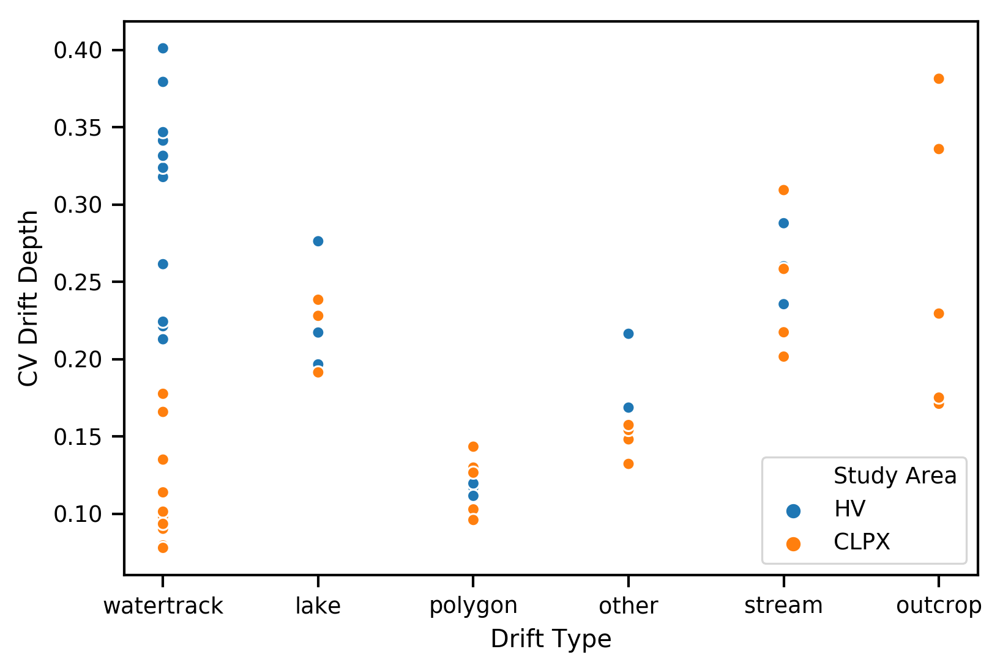

# Drift Classification

## Methods

Binary snowdrift masks were computed for each snow depth map (N=12) by applying our threshold snowdrift depth method (Figure __ Table _) to each map. From these masks we manually delineated 59 snowdrifts with high fidelity (similarity?). Then, using the snowdrift mask, a topographic hillshade map, and snow-free imagery, we classified each snowdrift based on its geography (not its snow) as one of six distinct types: water track (22), stream (7), polygon (12), outcrop (5), lake (7), and "other" (6). Each class is associated with a distinct landscape feature, and together (based on our field knowledge) are representative of variety of snowdrift features found throughout the two domains.

## Snowdrift Types

### Water track

Water tracks (c.f. McNamara et al.,  1998; Paquette et al., 2017) are hillslope water drainage pathways that are common in permafrost regions and include a broad range of geomorphic, soil, and vegetation characteristics (Trochim et al., 2016). Water track snowdrifts are abundant with HV and CLPX. The size and depth of an individual watertrack is limited by water availability (width) and permafrost (depth) - and so frequently create filling (a.k.a. Equilibrium or complete) snowdrifts. While a set of near-parallel hilllslope watertracks may all fill, they likely do so at different points throughout the winter because of the neighbor effects of an upwind snow trap - downwind water tracks within in a certain fetch of an upwind, not-filled neighbor will be starved for flux (only receiving precipitation and the flux from the intermediary interfluve scour zone) until the upwind neighbor reaches an equilibirum profile. It is possible this pattern of fill (integrated flux vs. easting) also influences the growth of the water track itself (nivation). 

### Polygon

Polygon snowdrifts occur in the ice wedge degradation troughs and may be found throughout an area of polygonal ground. The higher polygon centers are exposed to scour and snow is trapped beteen polygons. While polygonal features less abundant in our two domains, they are representative of large nearby stretches of Alaska's coastal plain (REFs (e.g. 1002 one)). Like watertracks, these snowdrifts are limited in size by the landscape (inter-polyon crack size depends on ice wedge degradation) and so they too frequently fill with snow. Networks of connected polygon snowdrifts are common and they unlikely to occur in isolation - meaning their filling rate is influenced by upwind neighbors as well. 

### Stream

Stream snowdrifts line the banks of drainage channels ranging in scale from small creeks to beaded streams to broad, braided glacial rivers. Some of these drainages overlap in geographic scale with water tracks, yet they are all distinguished from water tracks by having a sharp change in slope at the upwind lip of the drift trap. The depth and width of these stream snowdrift traps is a function of channel morphology processses - and so this snowdrift class includes both nonfilling and filling snowdrifts depending on the size of the catchement in relation to the amount of flux. The nonfilling kind record the upper flux limit for a winter (Benson ____). When the width of a stream trap is sufficiently small, the downwind lip of the trap can also influence the wind field and cause secondary snowdrift effects which influence the ultimate surface profile of the drift. For wide glacial rivers this "blowback" affect is absent, but for smaller streams it contributes to drift geometry and depth distribution (e.g. Put River?, REF?). The presence of snowdrifts on opposing banks is a good indicator that the flux source is at least bidirectional.

### Lake
Lakes, by nature of their shape, are often buffered by snow-trapping topography (where the lake depression begins to deviate from the surrounding landscape i.e. change in landscape curvature) and so lake snowdrifts are good indicators for the directionaly of the flux source (absent a confounding upwind landscape feature). When filled, lake snowdrifts form smooth 'aprons' of a near-constant slope that can span substantial (~5 m) differences in elevation between the start of the drift and the lake ice below. Like stream drifts, nonfilling lake drifts are far more dramatic with sharp cornice precipices.

### Outcrop & Other

At CLPX outcrop snowdrifts occur the lee of exposed sedimentary rocks left behind by the glaciation (geol. map). The steep windward face of the outcrop snowdrift is an obstacle that generates an eddy in its lee which traps blowing snow. These type of obstacle drifts may also have wind hollows (REF) along their flanks and a seconadr, smaller snowdrift growing on the windward side as well. Finally, the "other" snowdrift class has no obvious proximal cause or other obvious landscape feature that aids interpretation. However, they frequently occur on mild hillslopes of only a few degrees suggesting an upwind ridge is creating an 'aspect' drift similar to the ridge-top wind transport and loading process common in alpine snowcovers.

## Results

The census of 59 snowdrifts yielded 22 Water track, 12 polygon, 7 stream, 7 lake, 5 outcrop, and 6 "other" snowdrifts. Zonal snow depth raster statisitcs were computed for each census member (Table 1). The snowdrift volume to snowdrift area ratio (SVAR) and the coefficient of variance (CV) (Figure 2) of snow depth describe the area normalized snowdrift intensity and snowdrift capacity. Snowdrifts with SVAR values less that about 1.0 (red line, Figure 1) are mostly of the filling type: watertrack, polygon, and 'other'. Even normalized by area, the lake, stream, and outcrop drifts have higher VAR values because they are nonfilling to various degrees. VAR is a sense of how filled a snowdrift is in the context of the snowdrift class because each class has a different 3-D shape (e.g. Kuz'Min, Rikhter), or a characteristic shape that the snow can fill. The upper SVAR limit for each class (max SVAR = equiblibirum profile) will be different for a box shaped polygon crack than for a "spoon" shape like  water track.

The biggest filled drift is a minimux bound on the winter flux?

The relationship of snowdrift class to SVAR and CV help dilineate filling and nonfilling snowdrifts and highlight landscape-level differences between the CLPX and HV domains. Where VAR <= about 1.0 snowdrifts are are likely the filling type and are comprised mostly of the water track and polygon class. These of course are relatively smaller snowdrifts and include more of the HV sample (%) than the CLPX sample (%). When filled you have the most equitable depth - area distribution (a lower SVAR). Snowdrifts that that remain unfilled do so because the holes they have are too great for the amount of flux.

###### Table 1: Snowrift Zonal Statistics by Study Area and Snowdrift Class.

| Study Area | Drift Type | Drift Area [m^2] | Mean Drift Depth [m] | Mean Drift Volume [m^3] | Std. Drift Depth [m] | Median Drift Depth [m] | CV Drift Depth | Volume:Area Ratio |
|:----------:|:----------:|:----------------:|:--------------------:|:-----------------------:|:--------------------:|:----------------------:|:--------------:|:-----------------:|
|    CLPX    |    lake    |     23832.87     |         1.11         |         26790.93        |         0.25         |          1.09          |      0.22      |        1.11       |
|    CLPX    |    other   |     212890.41    |         0.87         |        186951.75        |         0.13         |          0.86          |      0.15      |        0.87       |
|    CLPX    |   outcrop  |      5432.37     |         1.32         |         7523.19         |         0.35         |          1.31          |      0.26      |        1.32       |
|    CLPX    |   polygon  |      370.17      |         0.89         |          350.7          |         0.11         |          0.88          |      0.12      |        0.9        |
|    CLPX    |   stream   |     20247.73     |         1.29         |         25456.22        |         0.32         |          1.28          |      0.25      |        1.29       |
|    CLPX    | watertrack |      2288.22     |         0.87         |         2056.39         |          0.1         |          0.86          |      0.11      |        0.86       |
|     HV     |    lake    |      71679.4     |         1.31         |         93953.47        |          0.3         |          1.32          |      0.23      |        1.31       |
|     HV     |    other   |      12722.1     |         0.98         |         11358.4         |         0.19         |          0.98          |      0.19      |        0.98       |
|     HV     |   polygon  |      850.86      |         0.84         |          720.4          |          0.1         |          0.84          |      0.11      |        0.85       |
|     HV     |   stream   |      2182.59     |          1.1         |         2420.86         |         0.29         |          1.09          |      0.26      |        1.1        |
|     HV     | watertrack |     20968.37     |         0.93         |         20217.42        |         0.28         |          0.88          |      0.31      |        0.92       |

###### Figure 1. SVAR by Snowdrift Class

###### Figure 2. CV by Snowdrift Class

The CV tells us about the 3-D shape of the trip. Polygon drifts have the lowest CV values, probably because they are filling drifts that have a box-like geometry caused by their depth at the edge being similar to the depth at the center. Watertracks at CLPX and Happy Valley are different. Lakes and Stream drifts have similar CVs, while Outcrop CV is variable.

Additionaly, there is a linear function between area and volume that is characteristic of each snowdrift class.

## Discussion

Some Drifts Fill more than others.

Discussion: Is there a relationship between max. VA ratio and equilibirum profile:
Construct artificial EQ drift and what is the va ratio and what is the slope?

Can area predict VAR? Is it different for filling vs. nonfilling?

What is the cutoff distance where wind no longer positive slope (far riverbank) has influence?

Manually delinateing drifts is efficient although not easily automated. The need for topographic and geographic map interpretation, as well as the highly connected nature of snowdrifts (as they are related to hydrography) makes automatically separating and classifying drift types difficult. A more concerted automatic classifying effort could make progress using geomorphometry and hydrographic data.  

