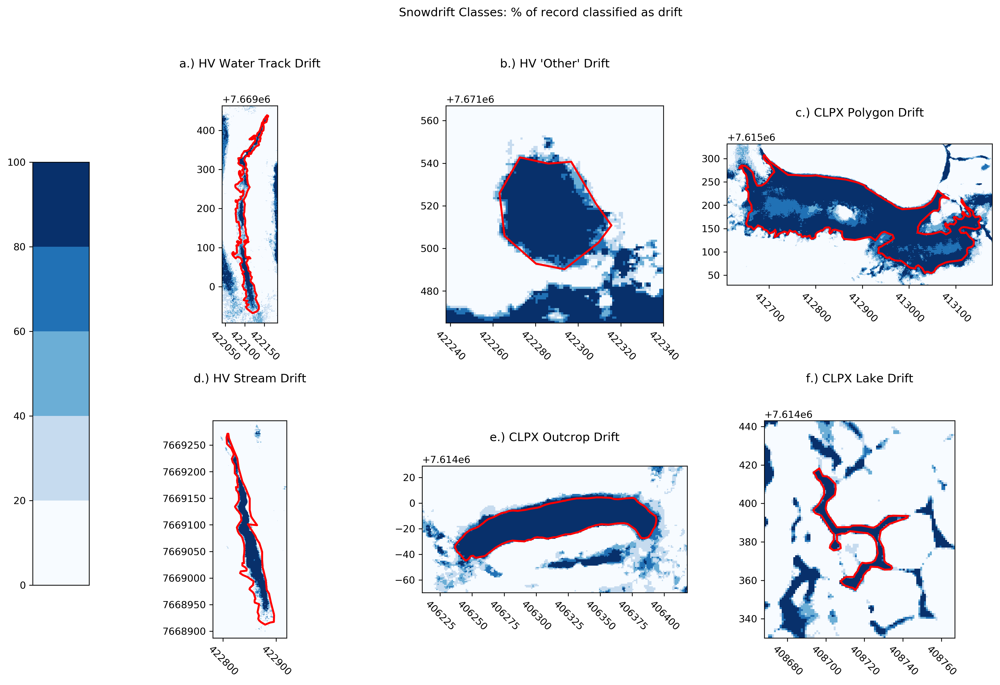
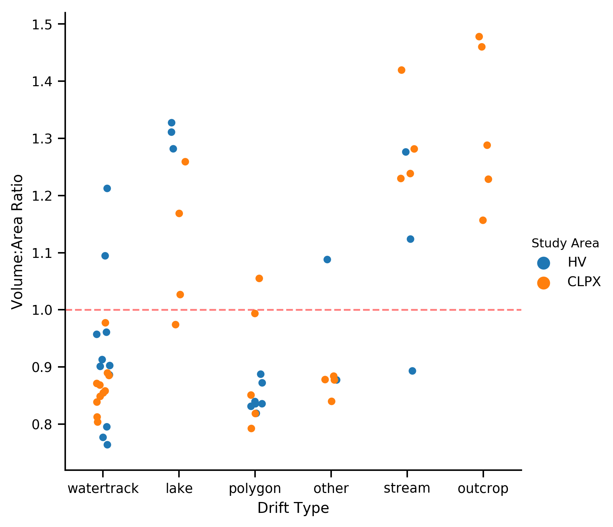
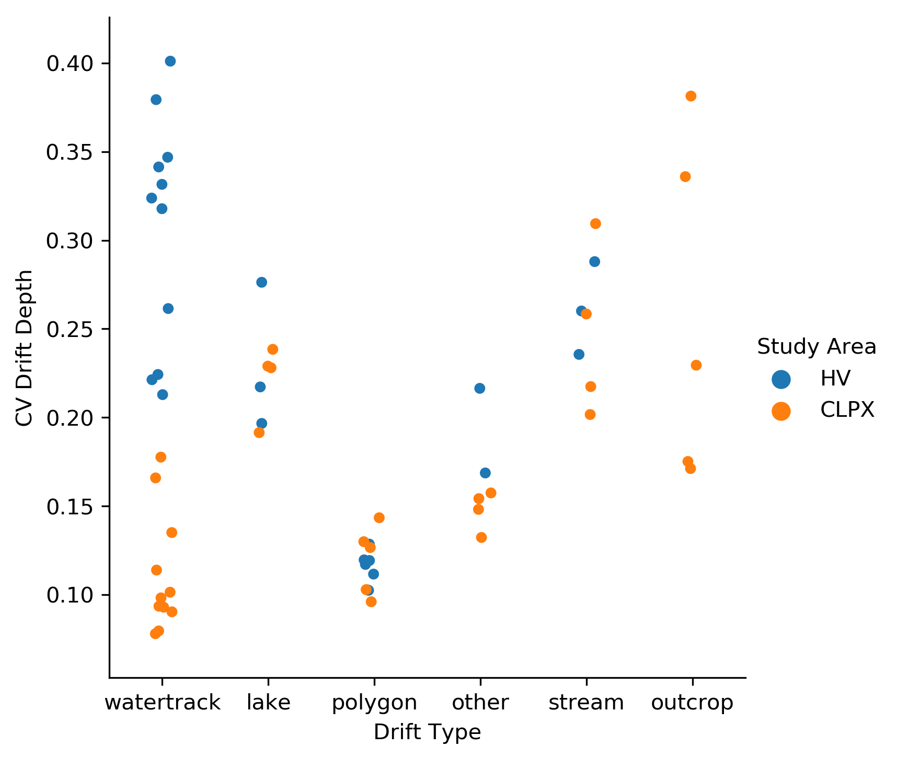
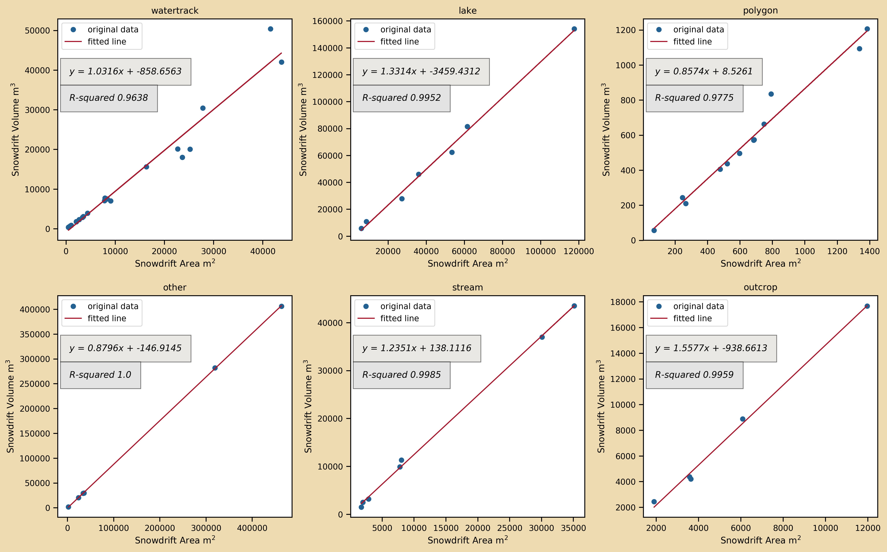

# Snowdrift Classification

## Methods

Binary snowdrift masks were computed for each snow depth map (N=12) by applying our depth threshold snowdrift identification method (Figure __, Table __). From these masks we manually delineated 59 snowdrifts with high year-to-year fidelity (similarity?). Then, using the snowdrift mask, a topographic hillshade map, and snow-free imagery, we classified each snowdrift based on its geography (not its snow) into one of six distinct types: water track (N=22), stream (N=7), polygon (N=12), outcrop (N=5), lake (N=7), and "other" (N=6) (Figure 1). Each class is associated with a distinct landscape feature, and together are representative of the variety of snowdrift features found throughout the two domains.

###### Figure 1. Six classes of snowdrift. Red polygon is manual delineation of the snowdrift feature.

## Snowdrift Classes

### Water track
Water tracks (c.f. McNamara et al.,  1998; Paquette et al., 2017) are hillslope water drainage pathways that are common in permafrost regions and encompass a broad range of geomorphic, soil, and vegetation characteristics (Trochim et al., 2016). Water track snowdrifts (Figure 1a) are abundant within HV and CLPX. The width and depth of an individual watertrack are limited by channel-forming procceses (i.e. runoff driven) and substrate properties (e.g. permafrost limits water track depth). These limits frequently constrain water track growth such that filling (a.k.a. Equilibrium, complete) snowdrifts are typical (Figure XXb). A water track rarely occurs in isolation - they are freuqently found in complex networks of linear or curvi-linear drainages, often running down a hilllslope together in near-pararllel fashion. (Figure XXa). Although the entire network is often covered by filling drifts, each individual drift likely fills at a slightly different rate because of how upwind water tracks can rob the downwind water tracks of flux. Within a certain fetch distance, a downwind water track will be starved for flux until the upwind neighbor reaches equilibium profile, thereafter passing the flux it would have trapped on to the next drift. In a flux-starved state, accumulation in a water track drift will be limited to precipitation and the flux from any immediately adjacent upwind scour zones (e.g. a raised, exposed interfluve). While we lack data on erosional rates, it is possible this staggered pattern of drifting and filling is directly related to water track growth and size (nivation), (Figure; integrated flux vs. Easting).

### Polygon
Snowdrifts fill the networks of cracks between high-centered polygons (cf. Gamon et al 2012; Jorgenson and Osterkamp 2005) whose distribution is linked to ice wedges and their melting. Such polygon snowdrifts (Figure 1c) occur on spatial scales of several and up to tens of meters. The raised polygon centers are exposed scour zones while the inter-polygon troughs trap blowing snow.
These drifts are less abundant in our two domains because of their foothill geography, they are ubiquiitous in Arctic lowlands such as the coastal plain (.e.g. ANWR 1002 area). Like watertracks, these snowdrifts are often filling and thus limited in growth by the depth and width of the inter-polygon trough., which are related to ice wedge degradation. Polygon snowdrifts are unlikely to occur in isolation and so their filling rate is also influenced by the filling state of neighboring uppwind drifts.

### Stream
Stream snowdrifts line the banks of drainage channels ranging in scale from small creeks to beaded streams to broad and braided glacial rivers. While some of these drainages may overlap in scale with water tracks, they are distinguished by having a sharper break in slope (i.e. a high profile curvature point) at the upwind edge of the channel. These sharp features (e.g. river cutbanks and bluffs) can create enormous snowdrifts when their trap volume (catchement depth * catchement width) exceeds the available winter flux - and in these instances such a nonfilling stream snowdrift is a record of the winter's flux from a certain direction (Benson ____). Stream snowdrifts bifurcate into filling and nonfilling types based on this flux to trap volume ratio. Trap volume is governed by channel processes. For stream drifts, the trap width alone plays an important role in snowdrift shape: if a trap is narrow enough the downwind edge of the channel also has a rotor effect on the wind field and creates a "snowdrift" on the opposite bank. Linear drainage channels may be good indicators of flux directions -they may have drifts on opposing banks indication a bidirectional source, for example, or snowdrifts may be conspicously absent after a 90 degree bend in the channel.

### Lake
Unlike the linear stream drifts, lake snowdrifts (Figure 1c) are often surrounded on all sides by topography with the potential to trap blowing snow.
An imaginary isolated, infinitely incised lake woulc be a perfect drip trap capable of locking up all flux from all directions. Absent a confounding upwind landscape feature, lake drifts are also good indicators of flux direction. When filled, lake snowdrifts form smooth 'aprons' of a near-constant slope that can span substantial (~5 m) differences in elevation between the start of the drift and the lake ice below. Nonfilling lake drifts are often dramatic with sharp, corniced precipices.

### Outcrop
Outcrop snowdrifts occur in the lee of exposed sedimentary rocks (and so are only within CLPX) left behind by the Itkilik and Sagavanirktok glaciations of III to JJJ years ago. (geol. map REF). Outcrops snowdrifts are generally of two kinds: First, there are outcrops with drifts in the lee of steep windward faces that may also have wind hollows (REF) along their flanks and a "secondary" smaller snowdrift growing up against the windward side. Second, there are ourcrops with steep leeward faces where the windward feature is a ramp leading to the sharp cliff. This second type may function similarly to nonfilling stream drifts, although comparison is difficult because they have no well defined potential trap (and trap volume). The first type is more akin to an obstacle drift and may find better parallels in urban or forested drift environments. 

### Other
Finally, the "other" snowdrift class has no obvious proximal cause or other conspicous landscape feature that aids interpretation. However, in our limited survey they frequently occur on hillslopes with mild grades of only a few degrees - suggesting that perhaps an upwind topographic ridge (or hillcrest) is creating an "aspect" (?) snowdrift in a similar fashion to the ridgeline wind transport and loading processes common in alpine snowcovers.

## Results

The census of 59 snowdrifts yields 22 water track, 12 polygon, 7 stream, 7 lake, 5 outcrop, and 6 "other" snowdrifts. Zonal snow depth raster statistics were computed for each census member (Table 1).

###### Table 1: Zonal Statistics by Study Area and Snowdrift Class.

| Study Area | Drift Type | Drift Area [m^2] | Mean Drift Depth [m] | Mean Drift Volume [m^3] | Std. Drift Depth [m] | Median Drift Depth [m] | CV Drift Depth | Volume:Area Ratio |
|:----------:|:----------:|:----------------:|:--------------------:|:-----------------------:|:--------------------:|:----------------------:|:--------------:|:-----------------:|
|    CLPX    |    lake    |     23832.87     |         1.11         |         26790.93        |         0.25         |          1.09          |      0.22      |        1.11       |
|    CLPX    |    other   |     212890.41    |         0.87         |        186951.75        |         0.13         |          0.86          |      0.15      |        0.87       |
|    CLPX    |   outcrop  |      5432.37     |         1.32         |         7523.19         |         0.35         |          1.31          |      0.26      |        1.32       |
|    CLPX    |   polygon  |      370.17      |         0.89         |          350.7          |         0.11         |          0.88          |      0.12      |        0.9        |
|    CLPX    |   stream   |     20247.73     |         1.29         |         25456.22        |         0.32         |          1.28          |      0.25      |        1.29       |
|    CLPX    | watertrack |      2288.22     |         0.87         |         2056.39         |          0.1         |          0.86          |      0.11      |        0.86       |
|     HV     |    lake    |      71679.4     |         1.31         |         93953.47        |          0.3         |          1.32          |      0.23      |        1.31       |
|     HV     |    other   |      12722.1     |         0.98         |         11358.4         |         0.19         |          0.98          |      0.19      |        0.98       |
|     HV     |   polygon  |      850.86      |         0.84         |          720.4          |          0.1         |          0.84          |      0.11      |        0.85       |
|     HV     |   stream   |      2182.59     |          1.1         |         2420.86         |         0.29         |          1.09          |      0.26      |        1.1        |
|     HV     | watertrack |     20968.37     |         0.93         |         20217.42        |         0.28         |          0.88          |      0.31      |        0.92       |

The snowdrift volume [m3] to snowdrift area [m2] ratio (SVAR) is greater for nonfilling drifts (outcrop, stream, lake) because they can trap more snow in a drift per unit area than their filling counterparts (water track, polygon, and perhaps "other"). In fact, snowdrifts with SVAR values less than about 1.0 (red line, Figure 2) are mostly of the filling type.
SVAR is in a sense a measure of how filled a snowdrift is with respect to its class because each class has a different, characteristic 3-D shape (e.g. Kuz'Min, Rikhter) that can be filled by drifting snow.

###### Figure 2. SVAR by Snowdrift Class

The coeffcient of variance (CV) of snowdrift depth (Figure 3) infers the type of snow depth probabilty distribution one might find within each drift class. Polygon drift CV values are quite low indicating a more uniform depth distribution, likely an artifact of their filling nature and box-like geometry. Depths at polygon drift edges are not much different than the depths at drift centers. The range of CV values for water track drifts is surprising and highlights landscape-level differences in the drift regimes between CLPX and HV. All CLPX water track drifts have CV values less than 0.20 suggesting a different, more uniform trap geometry than for watertracks at HV. Lake and stream snowdrifts have overlapping CV values reflecting the similarity of their trap shapes and potential to manifest as filling or nonfilling drifts. The outcrop drifts have a wide range of CV values.

###### Figure 3. CV by Snowdrift Class

## Discussion
Filled drifts have lower SVAR values because their potential trap volume is too great to be filled by the available flux. The theoretical maximum SVAR for a certain drift is related to its equilbirium profile (Compute these? What does the SVAR look like for a Tabler profile?). Then we can know how far from filling they are and what the SVAR limit is. If we construct an artificial equilbrium drift what is the SVAR and what is the maxiumum slope of the drift?
The upper SVAR limit will be different for a box shaped polygon crack than for a "spoon" shape like a water track. There is linear relationship between snowdrift area and volume that is characteristic of each snowdrift class (Figure 4).

###### Figure 4. Least-squares Regression by Snowdrift Class

The slopes of these lines (ranging between 0.8574 (polygon) and 1.5577 (outcrop) are the drift SWE [m] per unit area of drift type. Some landscapes (e.g. those rich in outcrops rather than polygons) are more "primed" for snowdrift.

What is the cutoff distance where wind no longer positive slope (far riverbank) has influence?

Manually delinateing drifts is efficient although not easily automated. The need for topographic and geographic map interpretation, as well as the highly connected nature of snowdrifts (as they are related to hydrography) makes automatically separating and classifying drift types difficult. A more concerted automatic classifying effort could make progress using geomorphometry and hydrographic data.  

