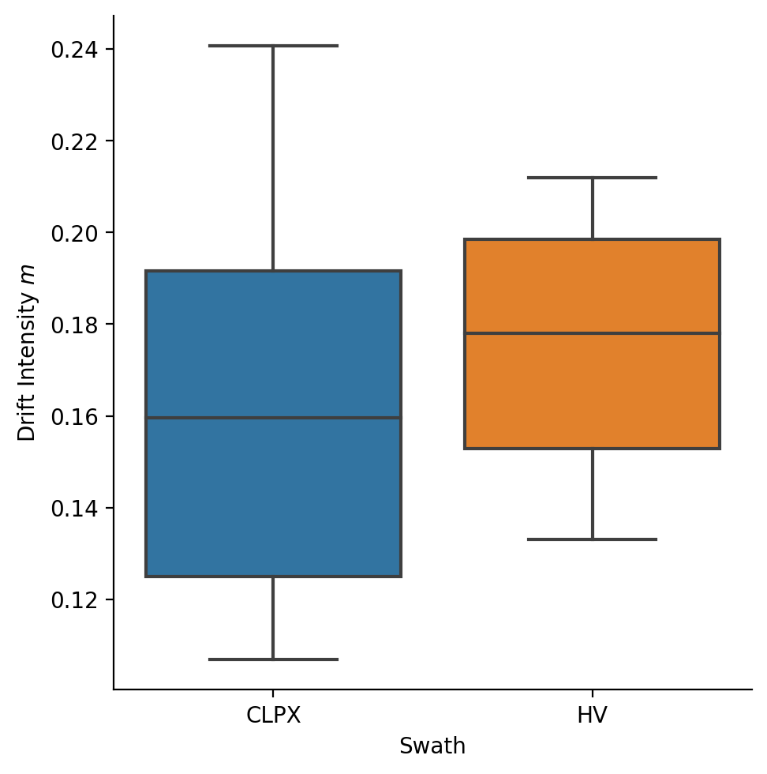
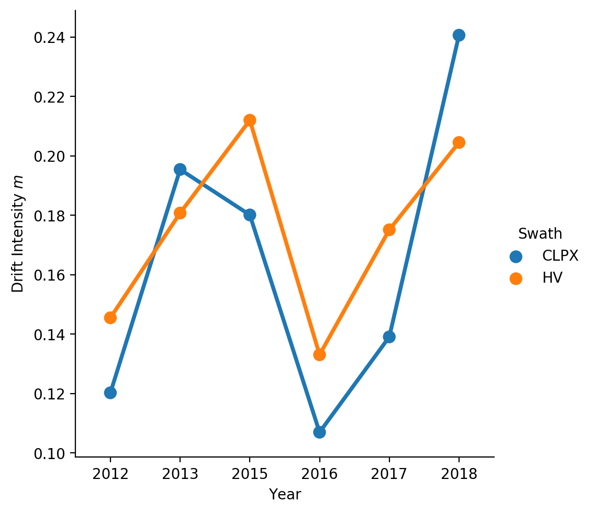
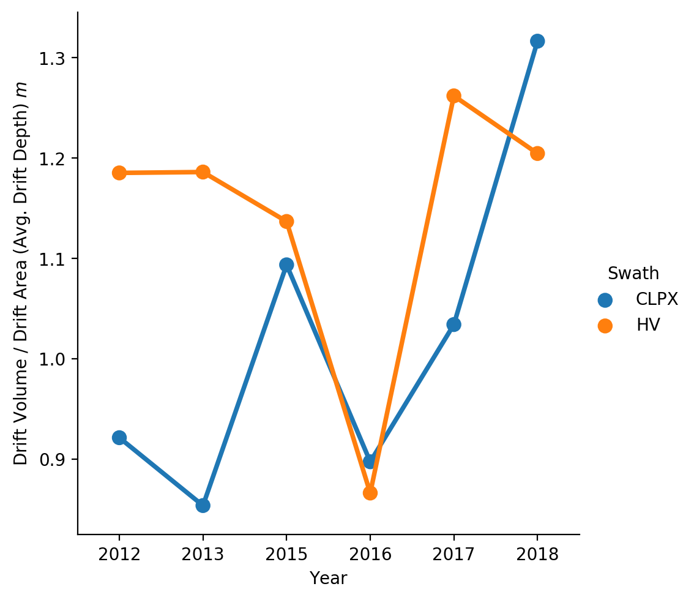
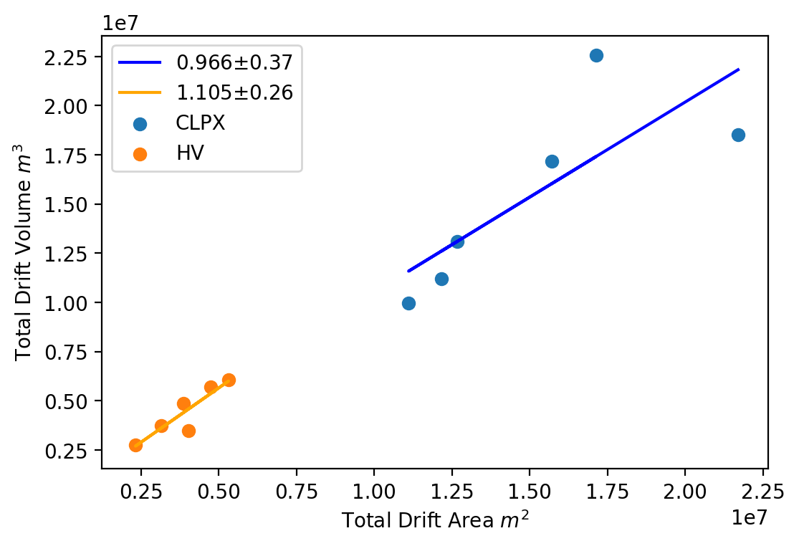
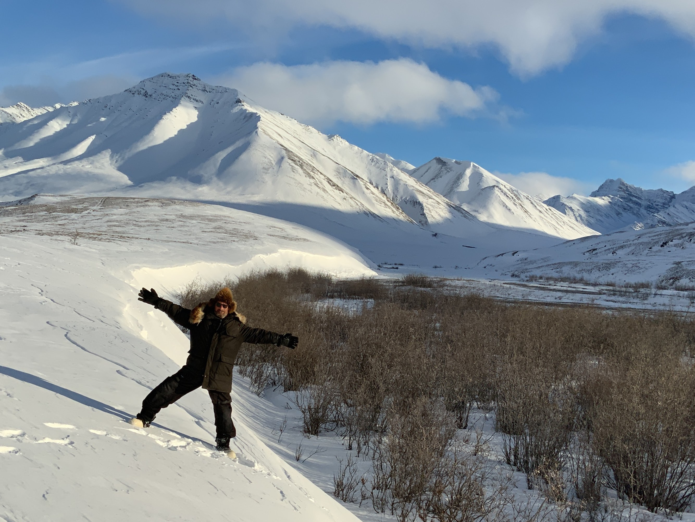

# Snowdrift Landscape Patterns: An Arctic Investigation

## Table of Contents

## Abstract
Insert Abstract Here.

## Introduction

The largest snowdrifts we have measured during four decades of Arctic snow research were 15 m deep and several kilometers long. Prior studies (Benson and Sturm, 1993; Sturm et al., 199_; Sturm and Stuefer, 2013) confirm that these large drifts form every winter, and summer satellite imagery (REF) provides evidence that due to their size, they rarely melt away before July. For two-thirds of the year these drifts *are* the landscape. This landscape role is not unique; outside of the Arctic, across the American prairies and the Rocky Mountains and Sierra Nevada and Coast ranges (REFS, Matthes, 1900), in the high basins of the European Alps (Fohn and Meister, 1983), in the Chugach Range and many other locations, drifts of similar size and duration exist.

###### *Figure 1. Drifts on the North Slope of Alaska, May 25, 2019. The broad white areas are lakes frozen but largely snow-free. The sinuous white areas are ribbon drifts formed in the lee of river cutbanks, lake edges, and bluffs. They range from several to more than 15 m deep, and from 0.5 to over 5 km in lineal extent.*

The impact of these big drifts on the landscape is not limited to just the drift areas: it extends to conjugate scour zones that invariably form upwind, the source of the additional snow. These scour zones can be several hundred meters wide and aldo tens of kilometers long. They serve important ecosystem functions for animals, for example allowing easy travel and winter grazing for caribou (Pruitt, 1959). At the same time, they create trafficability issues for oil and gas exploration, which is performed in winter and requires sufficient snow to avoid damage to the underlying tundra (ANWR Report REF).

It has been customary to treat these large snow drifts and their scour zones as a component of the seasonal snow cover, basically either areas of deeper than normal snow, known to contain more water and melt slower, or (scour zones) just the opposite, but neither separate from the rest of the snow pack. In this paper we treat these drifts as quasi-permanent landscape features, and consistent with that view, explore their geometry and distribution just as we might for other landscape features such as cirques, tors, or nivation hollows. As one rationale for taking a landscape perspective, we present multi-year data on the reoccurence and similarity of large Arctic drifts (e.g. *annual fidelity*) that confirms and strengthens the view that these are quasi-permanent landscape features. In the same spirit, we use detailed multi-year snow depth maps to produce a drift census of size, type and setting. While that census falls short of being a complete regional census, the results suggest that over 40% of the winter snow water equivalent (SWE) is stockpiled in drifts. We conclude based on their size, duration, and amount of water contained in these drifts that they warrant this landscape viewpoint. We end the paper by examining why drift fidelity is so high and the nature of the relationship between these snowy features and the underlying snow-free (and greener) landscape on which they form.

The drifts and scour zones create distinctive patterns on the landscape through the spatial arrangement of the two contrasting elements (or snow facies). These patterns are important because they spatially segregate snow-water resources and snow-related ecosystem services into distinctive zones. For instance, snow run-off in scour zones occurs in spring when the ground is still frozen, limiting infiltration, while melt water from drifts is delayed until summer when the ground has thawed and infiltration can occur. The drifts also tend to preserve and maximize the amount of snow that has fallen. Once blowing snow is stockpiled in a drift, it is removed from the transport system and thereby protected from the high (upwards of 40%) sublimation rates that accompany blowing snow (Essery et al., 1999; see also Pomeroy et al., 1997; Liston and Sturm, 1998) which is concentrated in scour zones. Confirmation of this conservation function has recently been observed in the Himalaya (Stigter et al., 2018) where a strong anti-correlation between the spatial distribution of sublimation intensity and the distribution of drifts was found.

## Background

The connections between snow, wind transport, and topography, while well known, are still not fully understood. The simplicity of the triadic relationship shown in Figure 2 masks surprising layers of complexity. One complexity has to do with *available snow*, which differs from the amount of snow actually present. The latter amount is the sum of winter precipitation (*P*) minus (or plus) transported snow (*T*), less sublimated snow (*S*), and less the snow trapped by vegetation (*V*). The *available* amount is a function in part of how much snow is present, but also the wind shear stress and the spatial distribution of the surface snow adhesion. The latter has proven difficult to measure or model because snow adhesion varies with grain characteristics and sintering, a temperature-dependent aging process. It is not surprising therefore, that prior studies that prior studies have documented over a 10X range in transport rates at any given wind speed (Sturm and Stuefer, 2013), a spread largely reflecting a wide range of surface snow conditions and therefore snow availability.

###### Figure 2. The triadic relationship between snow availability, wind, and topography.

The connection between wind transport and topography (gullies, river cutbanks, hillslopes, ridgelines, etc.) in principle is simpler: snow is deposited wherever the separation angle between wind streamlines and ground slope is sufficient to produce a local reduction in wind shear stress. But the finer details of this relationship are complicated by the turbulent nature of the wind when it blows over complex terrain. Eddies, rotors, and veering of the wind all take place. Local wind patterns are hard to measure without significant effort, hard to visualize, and hard to model, yet they directly affect drift geometry. Additionally, as drifts grow and change through the winter, their form begins to affect the wind fields around them: one might say that the wind-blown snow never *sees* the same landscape twice. Consistent with our landscape view of drifts, we invert the question of the linkage on this leg of the triad by asking "What does the drift form and geometry tell us about the wind and snow transport?"

Historically, the connection between transport and topography was studied using either a profile or a planimetric perspective. Engineers, faced with preventing railways and roads from being buried by drift (*cf.* Moore, 1922) sought optimal road cut profiles. Finney (1939), based on a combination of wind tunnel experiments and direct observations, concluded that for cuts steeper than 14&deg; eddies would form and deposit drifts that would clog the road. Rikhter (1954) and Kuz'min (1963) extended this work to more complex profiles, and this approach culminated in 1975 when Tabler, on the basis of 17 drift profiles from Wyoming and Colorado, developed an empirical drift profile regression model based on upwind and downwind surface slopes. He also introduced the term 'equilibrium profile' to describe the profile of a drift that cannot grow any more because the deposited snow has filled the catchment and eradicated the separation angle necessary for deposition. Tabler's equilibrium drifts are analogous to Cornish's (1902) *complete* (vs. *incomplete*) drifts, and Sturm and Benson's (1993) *filling* (vs. *non-filling*) drifts. Benson (1981) recognizing that if a drift was not filled, it could be used to measure the total winter flux, began an annual series of surveys to monitor drift volume in NW Alaska that has been continued sporadically since then and is the longest drift size/profile record from the Arctic.

The planimetric (mapping) approach has been used to investigate the distribution of drifts on the landscape. Kirnbaur (1991), Konig and Sturm (1998), Grayson et al., (2002), Winstral et al., (2002), and Parajka et al., (2012) all used aerial surveys to map drifts in plan view. A few planimetric studies (Klapa, 1980; Lauriol et al., 1986; Watson et al., 1994) tried to use aerial photos to produce a drift census, the goal being to use the change in drifts over time as a climate indicator. A few studies also used the planimetric approach (Luce and Tarboton 2004; Sturm and Wagner, 2010; Qualls and Arogundade, 2013) to quantify the annual fidelity of drifts.

Combining planimetric and profile approaches has until now been hampered by three things: 1) the lack of a quantitative definition of what constitutes a drift, 2) the lack of any way (other than laborious hand-probing) to map drift depth, and 3) the lack of algorithms for quantifying drift fidelity. Airborne lidar and structure-from-motion (SfM) snow depth mapping techniques have solved the second problem, and mapping is now becoming possible using satellites. More robust methods of image (i.e. pattern) comparison have been developed, in large measure due to digital signal processing needs (REFS). Lastly, here we introduce a quantitative definition of a drift.

## Field Areas

From 2012 through 2018 (except 2014) we mapped the snow depth annually across two swaths (CLPX and Happy Valley (HV)) in the foothills province of the Brooks Range in Northern Alaska (Figure 3). Physiographically, these swaths span two types of terrain: (1) undulating, broad piedmont hills cut by abundant water tracks, and (2) more rugged and rocky terrain with cliff bands (Table 1). Both swaths are tundra with some shrub-tundra and larger shrubs in riparian zones. The snow cover (excluding drifts) tends to be thin (< 0.6 m), comprised of six to ten layers, forms in September and lasts through May (see Benson and Sturm, 1993). Basal layers of depth hoar fill the inter-tussock spaces and are typically capped by one or more wind slabs. Prevailing winter winds come from the south in the CLPX swath, and from the west in the HV swath. The snowdrifts develop in water tracks, along river and stream cutbanks, along the edges of inset lakes, and below outcrops of flat-lying or slight dipping sedimentary rocks. Prior information on drifts in the area can be found in Sturm et al., 1995; Sturm and Wagner, 2011; Liston REF; Walker REF.

###### Figure 3. The study area in northern Alaska. The inset shows the location of the CLPX and Happy Valley (HV) swaths.

###### Table 1. CLPX and HV Physiography
|  Swath |  % Area with Slope  0&deg; to 5&deg; |  % Area with Slope 5&deg; to 10&deg; |  % Area with Slope 10&deg; to 15&deg; |  % Area with Slope 15&deg; to 30&deg; |  % Area with Slope above 30&deg; | Mean Elevation m | Std. Dev. Elevation m | Total Area km2 |
|:----:|:----------------------------------:|:--------------------------------:|:-----------------------------------:|:-----------------------------------:|:-----------------------------------:|:--------------------:|:-------------------------:|:-------------------:|
| CLPX | 70.2 | 22.7 | 3.7 | 3.2 | 0.3 | 861.6 | 53.4 | 96.5 |
| HV | 84.5 | 14.4 | 0.8 | 0.1 | 0.1 | 382.0 | 22.8 | 29.0 |

## Snow Depth Mapping Methods

Snow depth mapping was done using SfM photogrammetry (2015 though 2018) or lidar (2012 and 2013) and then adjusted to ground-based measurements (Figure 4). The area mapped each year was about 130 km2. To produce the maps, we: (1) conducted an airborne survey (snow-free) in June that was used to produce a snow-free digital elevation model (DEM) for each swath, (2) conducted multiple airborne surveys at near-peak snow cover each April that were used to create digital surface models (DSMs) of the snow cover, (3) generated annual high resolution (1 m) snow depth maps by subtracting the DEM from the DSM. Six such depth maps were produced for each swath between 2012 and 2018, comprising over 600 million individual geospatial snow depth records. The hardware, software, and processing steps used to go from the airborne survey data (photos or lidar returns) to snow depth maps is described in Nolan et al., 2015, King et al., 2019, and (REFS).

###### Figure 4: An example (from HV) of the snow mapping that forms the basis of this study. From left: a) the summer snow-free landscape b) a snow-covered orthomosaic image, c) a snow depth map, and d-g) two insets showing two (out of six) types of drifts from the drift census: top: ice wedge drifts; bottom: water track drifts.

Acquiring the snow-free DEM required careful timing because tundra plants leaf out before all snowdrifts completely melt. We acquired an initial DEM using airborne lidar in 2012 and a second DEM using SfM in 2017. Both were acquired in early June, but in 2017 remnant snowdrifts covered some important parts of the field area. The 2017 DEM, however, was derived from a denser point cloud and therefore better quality where not obscured by snow. The two DEMs were ultimately fused together to leverage their respective strengths and make a single snow-free DEM.

The snow depth maps were field-validated and adjusted using 141,207 ground-based probe measurements collected concurrently with the airborne surveys. Differences between snow depth maps (raster data) and field probe measurements (vector data) arise from errors in converting point clouds to gridded surface models and from geolocation errors in both sets of data. The probe measurements, which use a WAAS-corrected GPS, have a positional uncertainty of ± 2.5 m and a quasi-random vertical depth uncertainty ranging from 0 to 0.05 m caused by a tendency to 'over-probe' down into the substrate below the snow (Sturm and Holmgren, 2018). The DEMs and DSMs have a position uncertainty estimated to be ± 0.30 m (Nolan et al., 2015), resulting in snow depth pixel locations accurate to about ±0.40 m. Without correcting either pixel or probe positions, we overlaid and differenced the two measurement sets for each swath and survey (Figure 5; see also Deems et al., 2013). Mean differences between probe and snow depth map values ranged from -0.06 to 0.40 m (Table 2). As described by Nolan et al., (2015), we applied a global affine transformation to reduce the mean difference (probe minus snow depth map) value for each survey to zero. These offsets arise from the combination of positional and vertical errors, as well as 'pink' noise in the GPS signals that accumulates over the course of the airborne surveys (REFS?). Once adjusted, the resulting snow depth maps are accurate to about ±0.10 m, which with respect to delineating drifts (which are easily 20 times deeper) is insignificant. The resulting accuracy of the snow depth maps is comparable to that of other airborne snow depth mapping efforts (e.g. Deems et al., 2008; Deems et al., 2013; Westoby et al., 2013; Jagt et al., 2015; Nolan et al., 2015; Buhler, Harder, Painter, Currier et al., 2019; CHECK THESE AND MAKE A TABLE FOR CROSS-REFERENCE).

###### Figure 5. The 2015 field validation campaign for the CLPX swath. 8,308 ground measurements (black circles) were used to validate and adjust the snow depth map (Table 2). Note the extensive cutbank and lake drifts in eastern end of the map*

###### Table 2. Field Depths (Vector) Minus Snow Depth Maps (Raster), All Years.

| Year | Field Area | Count | Mean | Std. |
|:-----:|:------------:|:------:|:-----:|:----:|
| 2012 | CLPX | 32571 | 0.16 | 0.12 |
| 2012 | Happy Valley | 24601 | -0.04 | 0.16 |
| 2013 | CLPX | 27555 | 0.21 | 0.11 |
| 2013 | Happy Valley | 11718 | -0.03 | 0.16 |
| 2015 | CLPX | 8308 | 0.36 | 0.14 |
| 2015 | Happy Valley | 7030 | 0.18 | 0.14 |
| 2016 | CLPX | 11410 | 0.38 | 0.11 |
| 2017 | CLPX | 6165 | 0.4 | 0.15 |
| 2017 | Happy Valley | 5797 | -0.05 | 0.18 |
| 2018 | CLPX | 4178 | 0.25 | 0.18 |
| 2018 | Happy Valley | 1874 | -0.08 | 0.5 |
| Mean |  | 12837 | 0.16 | 0.18 |
| Total |  | 141207 |  |  |

## Results
### A General Snowdrift Census
In order to conduct a snowdrift census, we need to define a drift in a manner that can be automated and takes into account the variability of each winter. A drift is an area where there has been an additional accumulation of snow deposited by the wind, but how much additional accumulation indicates a drift, and how can we be sure (in planimetric mode) that the greater accumulation is a result of increased *T* rather than *P*? Researchers easily recognize drifts in the field[^1] , but that identification relies on layers of spatial and visual information including geometry, texture, and shadowing, factors difficult to derive from snow depth maps alone. Here we define a drift in an area of interest (AOI) using a snow depth threshold determined by testing the response of two functions to change in that threshold: F1 - the percentage of the AOI covered by drifts (% DA), and F2 - the percentage of total snow volume in the AOI contained in the drifts (% DV). To illustrate the procedure we construct a synthetic AOI with normal snow depth distribution with a mean (&mu;) of 0.50 m and a standard deviation (&sigma;) of 0.20 m (Figure 6).

###### Figure 6. Setting the drift depth threshold using depth and volume cumulative distribution curves.

If we set the drift threshold at zero, then 100% of the area would be classified as drift and all the snow volume would be stockpiled in those drifts, a nonsensical result. As we increase the threshold, both %DA and %DV decrease as expected, but at different rates. The difference between the %DA and %DV curves increases, reaches a maximum at the mean depth, then begins to fall. The *rate* at which this difference changes (the derivative of the difference function) has an inflection point at 0.70 m, and it is this value we then take as the drift threshold. This point is also the minimum of the derivative of the probability distribution function for the synthetic AOI. In this normally-distributed example, that threshold is 1&sigma; greater than the mean depth. In fact, prior to using %DA and %DV we used &mu; + 1&sigma; as an informal threshold value.

Without drifts, the %DA and %DV curves would continue to decline at equal rates. At deeper snow depths, it is more probably that large amount of snow volume are tied to small areas. The differential in the decline of %DA and %DV is why we can effectively find drifts with this method.

For real AOIs, we use numerical differentiation (NumPy REF) to compute the drift threshold. We have tested the method against numerous visual observations of drifts in the field and find it produces reasonable (and programmable) results. One caution: the spatial extent of the AOI needs to be chosen so that it includes a full range of landscape features typical of the area.

Applying the drift definition to the 12 snow depth maps from the CLPX and HV swaths (6 winters from each) we produced the drift census tabulated in Table 3. On average 15% of the area in both swaths was covered by drifts and these contained 30% of the swaths' snow by volume. From prior work (REFS) in the same field area, we know that drift snow density exceeds 0.40 g/cm3, while non-drift snow densities vary from 0.25 to 0.35 g/cm3. The drifts are not only deeper but also denser than non-drift areas, so we conservatively estimate that over 40% of the snow mass in the field area was contained in drifts (30% * [0.4 / 0.3]).

###### Table 3. Drift Census, CLPX and HV Swaths.
| Year | Swath | Snowdrift Depth Threshold $m$ | %DA | %DV | Total Drift Area $m^2$ | Total Drift Volume $m^3$ | Drift Intensity $m$ | Mean Drift Depth $m$ |
|:----:|:-----:|:-----------------------------:|:-----:|:-----:|:----------------------:|:------------------------:|:-------------------:|:--------------------:|
| 2012 | CLPX | 0.65 | 7.88 | 20.14 | 12158887 | 11202504 | 0.12 | 0.92 |
| 2012 | HV | 0.72 | 12.27 | 30.18 | 2325701 | 2756461 | 0.145 | 1.19 |
| 2013 | CLPX | 0.68 | 13.78 | 22.38 | 21703191 | 18528296 | 0.195 | 0.85 |
| 2013 | HV | 0.77 | 15.24 | 32.91 | 3151244 | 3737648 | 0.181 | 1.19 |
| 2015 | CLPX | 0.82 | 16.47 | 32.91 | 15718826 | 17190050 | 0.18 | 1.09 |
| 2015 | HV | 0.85 | 18.65 | 29.94 | 5320028 | 6047839 | 0.212 | 1.14 |
| 2016 | CLPX | 0.65 | 11.92 | 23.1 | 11109247 | 9969117 | 0.107 | 0.9 |
| 2016 | HV | 0.63 | 15.36 | 25.39 | 4032467 | 3492941 | 0.133 | 0.87 |
| 2017 | CLPX | 0.75 | 13.45 | 27.87 | 12676978 | 13109179 | 0.139 | 1.03 |
| 2017 | HV | 0.8 | 13.88 | 32.75 | 3861865 | 4873657 | 0.175 | 1.26 |
| 2018 | CLPX | 0.86 | 18.28 | 41.84 | 17139872 | 22564338 | 0.241 | 1.32 |
| 2018 | HV | 0.73 | 16.98 | 41.88 | 4743599 | 5713938 | 0.205 | 1.2 |

Note: The CLPX swath (96 km2) was 3.3X larger than the HV swath (29 km2) (Table 1) and this sample size difference is reflected in the area and volume values, but not the percent values.

The %DA and %DV values in Table 3 were remarkably similar between the CLPX and HV swaths despite distinct differences in their physiography (Table 1). The similarity includes the *drift intensity*, a metric that is computed by dividing the total drift volume (m3) by the total swath area (m2) and essentially reports the additional depth of snow (m) that would be present over the entire swath if all drift snow was mined out and redistributed evenly over the swath area. Under the assumption that the two swaths receive about the same amount of direct winter precipitation, these statistics suggest the two swaths experience about the same amount of wind transport and stockpile about the same amount of snow in drifts. However, the nature of those drifts must be different because the drift intensity value for CLPX varies nearly twice as much from year to year as the drift intensity value for HV, suggesting a greater trapping variability of the landscape. 

###### Figure 7. Drift census results. Drift intensity for the CLPX and HV swaths. Note that the range of of drift intensity was nearly twice as large for CLPX as for HV.

###### Not sure we need he below figures..or at least the second one as the slopes of the lines perhaps do not show a significant difference between CLPX and HV.

###### Figure 8. Volume-area relationships for the CLPX and HV swaths for all six mapping years. The slope values (0.966 and 1.105) are effectively the mean drift depth (m).

### Snowdrift Classification & Class Census
The similarity in the census results of the two swaths (Table 3) suggests a convergence in the overall amount of snow trapped in drifts across the study area, yet the nature of the drifts was different. To investigate how they differed, we defined six classes of drift based on landscape features, then collected drift census data by class. Starting with the binary snowdrift masks (drift vs. non-drift) that we created for the general census using the threshold algorithm illustrated in Figure 6, we looked for drifts that were persistent over the duration of the study. We did that by computing for each pixel the percentage of winters that the pixel achieved the drift classification (e.g., if for five out of the six winters the pixel was classified as a drift, the value would be 83%). Next, we looked for contiguous blocks of pixels indentified as a drift 80% of the time or more. Finally, for all such blocks, we delineated drifts where we could associate the drift with a clearly identified underlying landscape feature like a water track[^2]. The work, when completed, yielded 59 drifts that formed in the study area with high fidelity and which had recognizable forms: water track drifts (N=22), stream fill drifts (N=7), ice wedge drifts (N=12), outcrop drifts (N=5), lake drifts (N=7), and "other" (N=6). Using these results, we then computed drift statistics by class (Table 4).

###### Figure 9. Six classes of snowdrift. Red polygons are the manual delineation of the drift features. FIX TITLES, ORDER TO MATCH TEXT.

Water tracks (Figure 10, c.f. McNamara et al.,  1998; Trochim et al., 2016; Paquette et al., 2017) are lightly incised hillslope drainage pathways that show little branching are are controlled by permafrost. They are frequently found in networks of linear or curvilinear drainages, often running down a hillslope in near-parallel paths. By the end of winter the tracks generally hold filled (a.k.a. *equilibrium* or *complete*) drifts, but because the tracks rarely occur in isolation, upwind water tracks (before they are filled) can rob downwind neighbors of wind-blown snow: a downwind water track will be starved for flux until the upwind neighbor has reached its equilibrium profile. Although the more downwind tracks may be starved earlier in the winter, many tracks have conjugate scour zones which provide a source of snow (Figure 10). While it remains speculative, the quasi-regular spacing of water tracks across a hillslope (Figure 10) could be related to this winter drifting process with the tracks far enough apart to ensure each track has sufficient upwind flux such that it fills by end of the winter. The spring snowdrift melt then flushes the tracks with maximum run-off each year.

###### Figure 10: Regularly spaced water tracks in the HV swath. The upper panorama shows 9 nearly parallel tracks with the darks areas between the tracks thin snow that has been cratered by caribou foraging. The blue depth profile indicates the tracks hold about 1 m of snow and ground observations suggest most of the tracks had equilibrium profiles (wind from the west (right side of image). The tracks tend to hold willow and birch shrubs and appear darker than the surrounding tundra in summer (bottom). NOT SCALED OR GEOREFERENCED - REFACTOR THIS FIGURE. Add Ortho Overview.

Ice wedge drifts form in the network of troughs surrounding high-centered polygons (Black, 1952; Jorgenson and Osterkamp, 2005; Gamon et al., 2012). These troughs (which can be up to 1.5 m deep) develop because ice wedges thaw more rapidly than the permafrost in polygon centers. The drifts (Figures 9c and 11) occur on spatial scales of several to tens of meters, and the polygon centers are sometimes scoured free of all snow, producing an extreme variation in depth between ice wedge drifts and adjacent non-drift locations. Less abundant in our field area, ice wedge drifts are are ubiquitous across the Arctic coastal plain, where they are probably the predominant form. Like water track drifts, ice wedge drifts are generally filling.

###### *Figure 11: Ice wedge drifts in the 1002 coastal plain area of the Arctic National Wildlife Refuge. The network of ice wedges holds snow; the polygon centers are partially bare. The drifts in the troughs here were over 1.5 m deep in places.*

Stream snowdrifts, sometimes called ribbon drifts (Figures 12 and 9d), line the banks of creeks and rivers. These water courses are distinguished from water tracks by being larger, more incised, and most importantly, having sharper breaks in slope along channel edges. The sharper breaks, cutbanks, and bluffs that bound the streams and rivers are effective traps that can create enormous snowdrifts, drifts that frequently capture the entirety of the winter wind-blown flux from upwind. An oddity of the geography of northern Alaska is that many of the stream and river drainages trend south to north, while the winter winds are most often from the east or west, creating an ideal scenario for producing stream drifts. As shown in Figures 1 and 12, some of these drifts can extend tens of kilometers. The fact that most of these large drifts are non-filling drifts motivated Benson (1983) to use this type of drift to measure winter wind-blown flux rates. In fact, stream drifts can be filling or non-filling. Filled drifts form wherever the winter flux exceeds the equilibrium trap volume (**approx. one-half the integral of the inverse of trap cross-section? maybe this is important?**) and it is typically the width of the drainage that plays the most important role in determining whether the drift will fill. If the stream is narrow enough, a drift will not only form in the lee of the windward cutbank, but also on the opposite bank facing into the wind (a leading edge drift (Kuz'min, 1963)). When these two drifts coalesce, then the combined drift quickly fills to the equilibrium profile (Benson and Sturm, 1992; Figure 2) and ceases to grow.

###### Figure 12: A nonfilling stream drift extends for several kilometers along the Anaktuvuk River, Alaska. Replace with one from our study area?

Unlike the linear drifts formed by water tracks and streams, lake snowdrifts tend to be crescentic (Figures 13 and 9c). Many of the lakes in northern Alaska are incised and have a quasi-circular shape. Given that shape, they (in principle) trap wind-blown snow from all directions and so produce a 'flux rose' in the form of lake drifts from all directions. More often, prevailing winds from one direction produce a crescentic drift on one side of the lake while on the opposite side there is scour (Sturm and Liston, 2003; Derksen?). Filling lake drifts form smooth 'aprons' of a near-constant slope while nonfilling lake drifts are often dramatic with sharp, corniced edges followed by a sheer drop to the ice below (e.g. Figure 2).

###### Figure 13: A crescentic lake drift in CLPX. The snowmobile is near the edge of this near-circular lake; the depression to the left below the cornice is the snow-covered ice surface. This drift was 5 m deep.

Outcrop snowdrifts (Figure 9e) only occured in the CLPX swath for our field area where there are exposed tilted or flat-lying ledges (geologic map REF). There are two kinds: leading edge drifts that form against the base of windward facing cliffs (REF), and sheltered drifts that formed downwind of steep leeward faces. This second kind of drift is essentially the same as a non-filling stream drift (or ribbon drift) as described above, though often the outcrops are shorter, less linear, and have more convoluted potential drift traps.

The last class, the "other" snowdrift class (Figure 9x) are those drifts from our sample set that had no obvious topographic cause or association. These were most often found on hillslopes with mild grades of only a few degrees and formed irregularly-shaped patches, suggesting that perhaps some subtle upwind topographic feature had created enough flow separation to trigger snow deposition.

###### Table 4: Mean Drift Class Statistics by Swath.

| Swath | Class | Drift Area m2 | Mean Depth m | Drift Volume m3 | Std. Depth m | CV Depth | NDV m |
|:-----:|:---------------:|:----------------:|:--------------:|:------------------:|:--------------:|:--------:|:-------:|
| CLPX | ice wedge (f) | 369 | 0.89 | 350 | 0.11 | 0.12 | 0.9 |
| HV | ice wedge (f) | 850 | 0.84 | 720 | 0.1 | 0.11 | 0.85 |
| CLPX | lake (nf) | 23832 | 1.11 | 26790 | 0.25 | 0.22 | 1.11 |
| HV | lake (nf) | 71678 | 1.31 | 93953 | 0.3 | 0.23 | 1.31 |
| CLPX | other | 212890 | 0.87 | 186951 | 0.13 | 0.15 | 0.87 |
| HV | other | 12722 | 0.98 | 11357 | 0.19 | 0.19 | 0.98 |
| CLPX | outcrop (nf) | 5431 | 1.32 | 7522 | 0.35 | 0.26 | 1.32 |
| HV | outcrop (nf) | N/A | N/A | N/A | N/A | N/A | N/A |
| CLPX | stream (nf) | 20247 | 1.29 | 25458 | 0.32 | 0.25 | 1.29 |
| HV | stream (nf) | 2182 | 1.1 | 2420 | 0.29 | 0.26 | 1.1 |
| CLPX | water track (f) | 2287 | 0.87 | 2056 | 0.1 | 0.11 | 0.86 |
| HV | water track (f) | 20967 | 0.93 | 20216 | 0.28 | 0.31 | 0.92 |

Broadly, the six classes can be divided into filling (*f*) and non-filling (*nf*) drifts. Not surprisingly, non-filling drifts were deeper than filling drifts and had higher area-normalized drift volume (i.e. mean depths within the drift) because they could trap more snow per unit area. The NDV metric for a particular drift on a particular date, in a sense, is a measure of how filled that drift is with respect to what is normal for that class of drift. For example, a lake drift where NDV=1 would be under-performing for the class, but a water track drift where NDV=1 would be unusually deep for that class (Figure 14). There should theoretically be a maximum NDV (NDVmax) for a given drift that is reach when the dirft filled. Each drift class will have a different practical NDVmax that is related to the topographic profile of the snow-free surface for that class, and to the whether or not the drift is of the *f* or *nf* type. If we knew NDVmax for that drift, we could know how far from being full the drift was at the time it was measured, or to put it another way, how much more flux the drift can stockpile. While NDVmax undoubtedly varies with the specific local drift geometry, we suspect it may only vary over narrow limits for each class of drift because they are tied to landscape features.

###### Figure 14: NDV values (snowdrift volume-to-area ratios) for six classes of drifts. The red dashed line roughly separates filling from non-filling drifts.

The filling status as a function of drift class seen in the NDV results is mirrored in the coefficient of variance (CV) of drift depth for each class (Table 4 and Figure 15). CV values suggest the type of depth distribution curves one might within each drift class. For example, ice wedge drift CV values are low for both swaths, suggesting a more uniform drift depth distribution with little difference due to specific field location. This makes sense: the box-like shape of ice wedge troughs, a product of subsurface thawing, ensures that most snow depths in such a drift will be about the same. The depth of these drifts (about 1.5 m) is driven by the regional climatic warming, not local micro-climates. On the other hand the range of CV values for water track drifts is distinctly different for the two swaths, with the HV water track drifts showing considerably more variability in depth. The drift snow depth in these features is a complex function of the length of the hillslope, the active layer thickness, slope, and aspect. The 2X range in CV values suggest that the CLPX water tracks have different characteristics, and perhaps are more similar to ice wedge drifts, than the HV ones.

###### *Figure 15. CV values by drift class.*

We have regressed drift volume against drift area for each class (Figure 16) in the same manner as Figure 8. The slopes of these lines, ranging from 0.86 (ice wedge) to 1.56 (outcrop) are once again the predicted average drift depth for a drift in that class (i.e. the NDV). The range in slopes indicates that *nf* landscapes are better "primed" to trap snow than *f* landscapes. A slope value of around 1.1 appears to be the transition value between *f* to *nf* drifts. If all these drift classes existed on the same scale as they are portrayed in Figure 16, the *f* type drifts would likely have even steeper slopes as they would be closer to their NDVmax.

###### *Figure 16. Least-squares linear regression of volume area relationships by snowdrift class with all y-intercepts set to zero and plotted on a common range for comparison.*

### Snow Pattern Fidelity

###### *Figure 17: The same area shown in Figure 10 but now in planimetric view showing the exceptional fidelity in drift and scour patterns over a six year period. Note that in some cases even fine details (order 1 m) are preserved. The high degree of fidelity shown here is in part due to the fact that this is a hillslope cut by filling water tracks.*

Several prior studies have noted the strong year-to-year similarity of drifts on the landscape (REFS) and the class census (above) revealed a high annual fidelity in the core areas of the 59 drifts we examined. To assess this year-to-year fidelity in greater detail (and to incoporate conjugate scour zones) we applied four metrics of fidelity to the data. These are metrics that have been developed for computer vision and image quality assessment applications (REFS). All have been rescaled to enable comparison with a score of 1 indicating perfect similarity (i.e. a self comparison) and a score of 0 indicating no similarity. The four metrics are:

**1. Normalized Mean Square Error (NRMSE):** NRMSE is sensitive to individual element (i.e. pixel)-wise differences in two patterns, but not to larger structural differences. Consequently, at the downwind endges of non-filling drifts, zero scores will be recorded while values of 1 are likely on the upwind edges. NRMSE alone is not a as useful for determining whether or not different structures (drift or scour elements) are present. We employ NRMSE (REF) for reference and for historical continuity in our field area (see Sturm and Wagner, 2011). NRMSE yields both a global value for an AOI (the mean of all individual pixel values) and a map of overall pattern fidelity for each pair of images compared.

**2. Structural Similarity Index Method (SSIM):** The SSIM metric (Wang et al., 2004) is computed using convolution matrices that compare snow depth, the standard deviation of snow depth, and structural information (the covariance of the two snow depth maps). Created to more closely mimic the human visual system, SSIM is tuned to local areas of strong spatial correlation, which is a hallmark of drift and scour patterns, which are highly structured because snow depths are locally correlated within each element. This structural sensitivity means that SSIM is useful for highlighting the emergence or disappearance of drift or scour elements between two snow depth maps and likely indicating a change in flux or flux direction.

**3. Complex Wavelet Structural Similarity Index Method (CW-SSIM):** Implementing SSIM in the complex wavelet domain (Wang and Simoncelli, 2005) yields a metric that is insensitive geometric distortions that are smaller than the width of the wavelet used in the transformation. A pattern can be shifted, rotated, etc. without influencing the similarity score. CW-SSIM yields a global index value that is useful, but the map of CW-SSIM values only reflects the periodicity of the wavelet.

**4. Gradient Magnitude Similarity (GMS):** GMS (Xue et al., 2014) computes the pixel-wise difference between gradient (derivative) magnitude maps by convolving a Prewitt kernel in both the x any y directions, thereby removing the effect of global variation in depth. GMS returns a global index value and similarity map. Because GMS is comparing gradients, it allows us to see how snow depth transitions (snow depth rates of change) are different across two snow depth maps. Similar to NRMSE, this will highlight changes at the edges of snowdrifts.

None of the four metrics is as skilled and nuanced as the human eye in detecting fidelity, but together they allow us to define a novel and more continuous scale for year-to-year fidelity and a more quantitative assessment that patterns of drift and scour largely repeat themselves year after year (Figure 17). In particular, very high fidelity is found across all of the metrics in areas where the drifts typically fill, a point discussed later.

We have computed the four fidelity metrics for all snow depth map pairs (2012 vs. 2013, 2012 vs. 2015, etc., N=120) as illustrated in Figure 18. NRMSE tends to indiciate the highest fidelity in the thin and scoured areas adjacent to the water track drifts, while SSIM does just the opposite. CW-SSIM and GMS are more nuanced, indicating a cross-wind/cross-drift alteration of higher and lower fidelity scores, suggesting the main loci of the drifts is in the same place, but the drift profiles show some variation in where the deeper and shallower areas can be found. 

| Swath | NRMSE | SSIM | CW-SSIM | GMS | Avg. Similarity Score |
|:------------:|:-----:|:----:|:-------:|:----:|:---------------------:|
| CLPX | 0.61 | 0.82 | 0.82 | 0.85 | 0.77 |
| Happy Valley | 0.71 | 0.87 | 0.85 | 0.87 | 0.83 |

###### Figure 18. The four metrics computed for two snow depth [m] maps (2016 and 2017) from the HV water tracks (same area as Figures XX and YY). Note that the CW-SSIM map pattern only reflects the wavelet width parameter.

###### Table 5. Aggregate Mean Similarity Results. Each AOI comparison pair (e.g. winter of 2012 compared to winter of 2013) is percentile ranked for similarity across all four metrics. Higher percentiles were more similar patterns (greater fidelity) compared to the other observations.

###### May also need to show raw metric values to show high levels of absolute similarity.

**We need to use the fidelity metrics to go right to the heart of the matter….and we need I think to explicitly talk about the conjugate to drift fidelity./…scour infidelity.   Right now, this section has a big build-up describing the 4 metrics, but not enough take home message of what those metrics told us.*

**Insert profile views of drift and scour for high and low fidelity cases, for example 2012 v 2017 HV Polygons have high fidelity, CLPX lake 2012 vs. 2017 is low**

**Of course like drift threshold, this fidelity metrics depend on size of AOI**

## Discussion
In our field area drifts occupy 15% of the landscape, 30% of the snow volume, and (estimated) 40% of the SWE. Drifts are far more important than their areal fraction alone would suggest. We can subdivide these drifts into filling and non-filling types and divide them even more into landscape feature related classes. While these separations have been made previously in the field and in profile view (REFS: Ekblaw, Lewis, etc.), the different snow stockpiling behaviors (depth distribution curves, CV values), forms, and geometries that we derive from the combination of planimetric and profile approaches taken here are novel. The snowdrift classes are useful archetypes for refining the linkages between snowdrift (and scour), wind transport, and topography (the snowdrift triad, Figure 2). Each class will typically exhibit *f* or *nf* properties within a field area: lake, stream, and outcrop drifts are of the *nf* type and so while they may be deeper, they tend to be fewer in number. Water track and ice wedge drifts (*f* type) do not stockpile as much snow, but occur in networks at greater areal density. The *f*-*nf* division is also seen in the year-to-year fidelity of the drifts. The *f* type drifts always have enough flux to fill and thus they repeat with extremely high fidelity, while the magnitude of *nf* drifts are flux dependent and thus are more sensitive to the variability of each winter and have lesser fidelity compared to *f* drifts. The physical scale of the snowdrift classes has breaks (i.e. the classes do not scale linearly in size), and so it is likely beyond the bounds of the climate regime to have such a dramatic change in flux that causes a *f* to *nf* transition, or vice versa. However, it is possible that some type of "goldilocks" drift is out there that is just the right size such that in some winters it is *f* and in other *nf*.

While relative differences in fidelity exist between snowdrift classes, the absolute level of fidelity within the snow maps is remarkably high (Table __). The tundra snow depth patterns repeat each year with drift and scour elements arranged in much the same way. How is this constancy possible? Of the snowdrift triad (Figure 2) there are inherent amounts of variability: for simplicity, assume the top and left legs (wind transport and available snow) are functions of the winter weather (ignoring their alteration by topography). Although for our field area (and for much of the snowdrift world) metereological data is not available, we know they are broadly bound by climate: the length of winter, number of storms, and prevailing winds. Within these climatic bounds there is substantial variability: the trajectory of a single winter: the magnitudes and timings of *P*, *T*, and *S* events are impossible to predict. The top and left vertices of the triad move - but the cumulative results converges on *f* and *nf* drift classes to produce a snow pattern of drift and scour that is essentially the same each year, and this convergence occurs because the right vertex of the triad (topography) anchors the entire triadic relationship. Landscape filters the variability of each winter and funnels the unpredictable trajectories toward a convergent, cumulative result: the snow patterns and snowdrift classes seen here. Convergence of snow patterns has a rich history (REFS: Matthes, Yukigata, Bloschl, Sturm & Wagner), and now the length of our time series, large number of ground validation points, and fidelity metrics show that convergence is perhaps the rule, not the exception, and that in the Arctic where drifts are particularly long-lying, the snow depth patterns of various *nf* and *f* drifts (and scour) **are** the landscape.

# Conclusion
The capacity to measure snow depth from space is emerging (REFS), and so discerning drift from not-drift snow over large areas will be essential for snow hydrology. High resolution DEMs are also increasingly prevalent (e.g. the ArcticDEM) and so we have more knowledge than ever about the snow-free landscape which may be leveraged to find and measure potential *f* and *nf* drift traps, thereby constraining regional snow depth distributions, even if metereological data and/or snow depth measurements are sparse (e.g. ICE-Sat altimetry points on deep, high fidelity stream drifts). We now know that some landscapes are more optimized to stockpile snow in drifts than others based on the frequency and density of *f* and *nf* landscape features as seen in the drift intensity values of our swaths (Table 3). The landscape equivalence of snowdrifts is also perhaps why persistence mapping (Macander REF) is effective - aspect is important for drifting more so than solar exposure when it comes to persistence, and so there is great opportunity to leverage optical remote sensing products and existing persistence maps to predict snow depth distributions. Finally, snowdrifts are recursive. Nivation (REFs) processes may incrementally increase drift trap size and subsequently the snowdrift itself in a feedback loop that creates ever-larger drifts when flux is sufficient - a process which, unchecked, may be the genesis of a new ice age (Lauriol REF).

## References

[^1]: Here we focus on large "fixed" drifts, drifts that are tied to permanent topographic features. We disnguish these from bedform drift features like the dunes amd barchans described by Filhol and Sturm (2015) and Kochanski et al. (2018). 
[^2]: Automating the classification may be preferable, but a unsupervised classification effort will require feature engineering from topographic, geographic, and hydropgraphic data. The highly connected nature of snowdrifts makes separating and classifying them difficult.

###### Other drift stuff
1. Nivation
2. Complex Networks
3. Ice Age
4. Caribou Cratering
5. ANWR
6. Staggered water tracks (integrated flux)
7. Small drift (ice wedge) susceptibility to P rather than T

