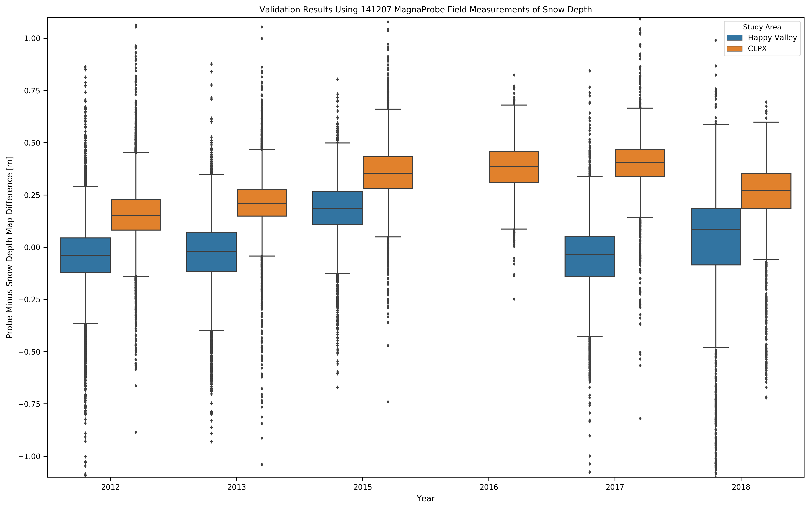
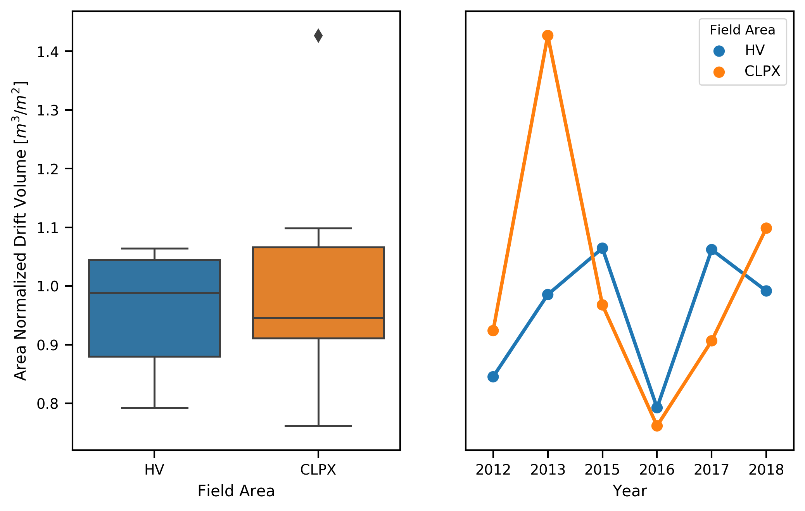
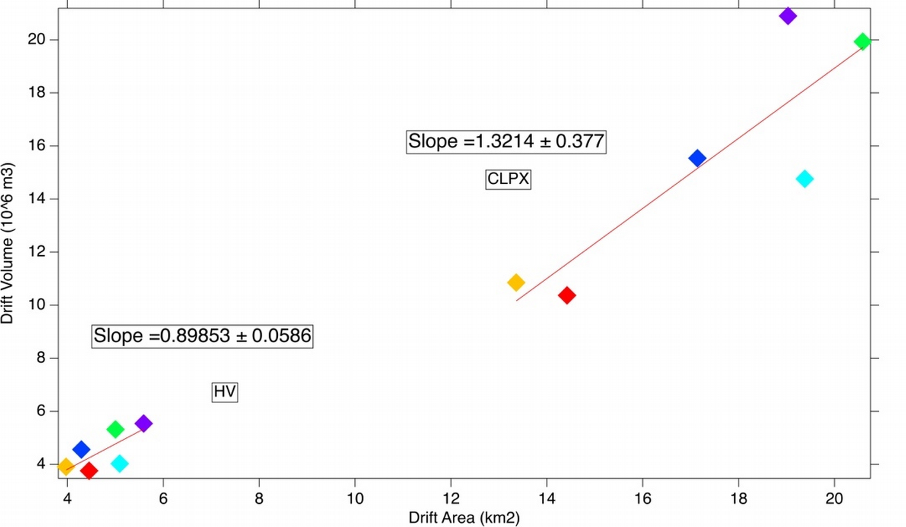
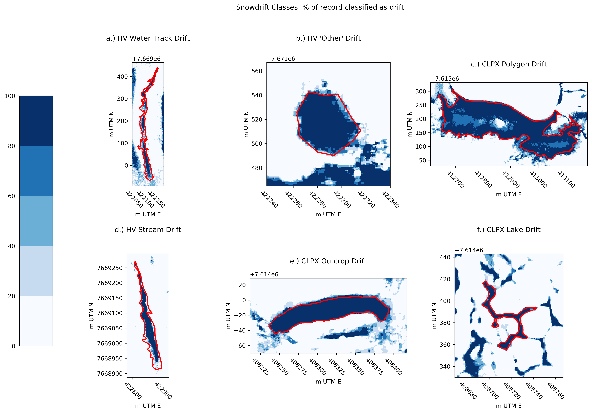
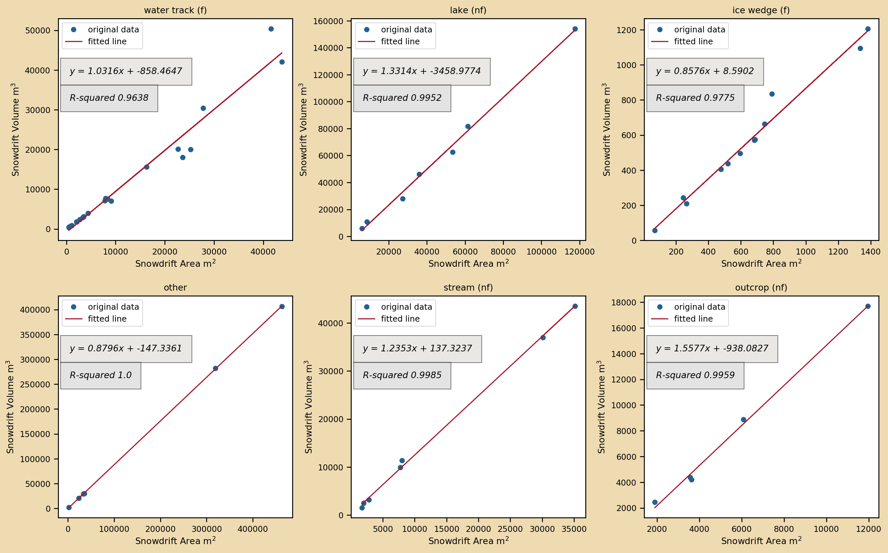

# Snowdrift Patterns: An Arctic Investigation

## Table of Contents

## Abstract
Insert Abstract Here.

## Introduction
Distinct spatial patterns of snow properties (depth, density, hardness) are common in nature and occur across spatial scales ranging from continental (106 m, e.g. snow classes (Sturm et al., 1995)), to regional (105 m, e.g. glacier facies (Benson, 1962)), to local (e.g. 10 m snow bedforms). The processes that produce these patterns function over years (climate patterns) to hours, with surprisingly rapid pattern development possible in windy locations where snow transport rates can exceed decigrams/m2s-1. Not surprisingly, some of the most distinctive snow patterns are found in tundra and prairie snow classes, where wind transport is frequent. These tundra and prairie snow patterns reflect the spatial arrangements of two elements (or facies): snow drifts, the "sinks" for windblown snow, and scour zones, the sources.

The snow patterns produced by these elements are important because drifts provide runoff in the summer long after the rest of the snow cover is gone. On the tundra, this delayed runoff occurs when the seasonally frozen ground has thawed, allowing meltwater to infiltrate the soil. Drifts also increase the overall amount of water stored across a landscape because once stockpiled in a drift, snow is removed from the transport system and protected from the high sublimation rates that accompany blowing snow (e.g. up to 47% of the annual snowfall is lost to sublimation (Essery et al., 1999; see also Pomeroy et al., 1997; Listion and Sturm, 1998)). Recent work in the Himalaya (Stigter et al., 2018) indicates a strong anti-correlation between the spatial distribution of sublimation intensity and the distribution of drifts.

In tundra and prairie snow covers the connections between snow, wind transport, and topography are tight (Figure 1), yet surprisingly complex. A key difficulty is that the snow "available" to drift differs from the amount of snow present. That latter amount is the algebraic sum of winter precipitation ( *P* ) minus (or plus) snow already transported, less sublimated snow ( *S* ), and less the snow trapped by vegetation ( *V* ). The amount available for transport is limited by how much is present, but also controlled by the wind shear stress, which must exceed the surface snow adhesion before transport will occur. Since adhesion varies with sintering, a process affected by snow age, the end result is that predicting the actual flux can be quite difficult even when quality meterological data is present - a condition lacking for much of the windy, snow-covered regions of the Earth. It is not surprising, therefore, that prior studies have documented a 10X range in transport rates at any given wind speed (Sturm and Stuefer, 2013).

###### Figure 1. The Snowdrift Triad: Snow, Wind, and Topography.

The relationship between transport and topography (gullies, river cutbanks, hillslopes, ridgelines, etc.) is simpler: snow is deposited wherever the separation angle between wind streamlines and ground slope is sufficient to produce a local reduction in wind shear. The finer details of this relationship are complicated and turbulent, for when wind blows over complex topography eddies, rotors, and turning of the wind results. Such wind patterns can be hard to visualize and are even harder to model, yet they affect drift geometry. Additionally, as drifts grow and change through the winter, so do the wind fields around them. Wind-blown snow does not travel the same landscape twice.

But at an even more basic level, we lack fundamental statistical information about drifts and topography. For example, in what sort of topographic regime does the maximum proportion of snow accrue in drifts? At watershed, regional, or global scales, how much of the winter snowfall is stockpiled in drifts?[^1] Does it vary widely with the amounts of wind and snow?

In this paper, using six years of aerial photogrammetric or lidar snow depth mapping (Figure 2) covering over a hundred square kilometers of tundra snow in northern Alaska (Figure 3), we explore the drift-topography relationship (Figure 1) and produce a drift census. Of particular interest is the extent to which the individual drifts take on the same geometry year after year (similarity), and how stable over time existing landscape patterns of scour and drift are likely to be (fidelity). While our study falls short of being a regional census, the results suggest that drifts in this sector of the Arctic can lock up nearly 40% of the snow water equivalent (SWE) each winter and therefore warrant attention.

###### Figure 2. An example of aerial snow depth mapping at Happy Valley illustrating how polygon cracks (top inset) and water tracks (bottom inset) are filled by snowdrifts.

## Background
Historically, drift studies have taken either a profile or a planimetric perspective. Engineers, faced with preventing railways and roads from being buried by drift (*cf.* Moore, 1922) sought optimal road cut designs, usually presented in cross section (i.e. profile). Finney (1939), based on a combination of wind tunnel experiments and direct observations, concluded that for slopes greater than 14 degrees wind eddies would form and produce snowdrifts. Rikhter (1954) and Kuz'min (1963) explored this topic and the geometry of drift traps further, and that work culminated in 1975 when Tabler, on the basis of 17 profiles measured in Wyoming and Colorado, developed an empirical drift profile regression model based on upwind and downwind surface slopes. He also introduced the term 'equilibrium profile' to describe the shape of the surface of a snowdrift that cannot grow any further because the deposited snow has filled the catchment and eradicated the separation angle necessary for drifting. Tabler's equilibrium and non-equilibrium drifts are analogous to Cornish's (1902) complete vs. incomplete drift classification (defined using profile diagrams) and also equate with the filling or non-filling drifts described by Sturm and Benson (1993). Recognizing (as did Cornish and Tabler) that if a drift was not filled, it could be used to measure the total winter flux, Benson (1981) began an annual series of surveys to monitor drift volume in NW Alaska that has been continued sporadically since then.

The planimetric (mapping) approach has generally been used to understand the distribution and prevalence of drifts on the landscape. Kirnbaur (1991), Konig and Sturm (1998), Grayson et al. (2002), Winstral et al. (2002), and Parajka ae al. (2012) all used aerial surveys to map drifts. A few studies (Klapa, 1980; Lauriol et al., 1986; Watson et al., 1994) have tried using aerial photos to conduct a drift census, seeking to use drifts as wind/precipitation climate indicators. Several studies using a plainmetric approach (Luce and Tarboton 2004; Sturm and Wagner, 2010; Qualls and Arogundade, 2013) have attempted to quantify the interannual similarity and fidelity of the drift patterns using map-based approaches.

Combing planimetric and profile approaches has been hampered by three things. First is the lack of a quantitative definition of what constitutes a drift, which we address later. Second has been the inability to map drift depth when working in the planimetric mode. Until recently, depth has had to be measured manually, limiting sample size and extensive drift inventories. Third, we have lacked sophisticated tools for quantifying drift similarity over time (or lack thereof).

Fortunately, we can now map drift depths over large areas using airborne lidar or structure-from-motion (SfM) techniques (REFS), and similar mapping is becoming possible using satellites (REF). More robust methods of comparing spatial pattern similarity have been developed, in large measure due to computer security needs (Jetten, 2003, REF). In the past, these comparisons have been sensitive to small differences in pattern, obscuring greater similarities (Wang and Bovik, 2005). Minor geometric distortions and signal noise (common in many remote sensing products) tended to produce low similarity scores (compared to human observers) even when patterns were largely similar, but modern algorithms (REFS) have largely rectified this problem.

## Field Areas
Each winter between 2012 and 2018 (except 2014) we mapped the snow depth across two swaths, CLPX and Happy Valley (HV), of the Kuparuk and Sagavanirktok watersheds of Arctic Alaska (Figure 3). Physiographically these swaths lie in the foothills province of the Brooks Range and span two types of terrain: (1) undulating, broad piedmont hills (typified by Imnavait Basin) with abundant water tracks, and (2) more rugged and rocky terrain with cliff bands. Field areas are entirely tundra-covered with some shrub tundra and larger shrubs in riparian zones. The snow cover (excluding drifts) in the region tends to be thin (< 0.6 m), comprised of six to ten layers, forms in September and lasts through May (see Benson and Sturm, 1993). Basal layers of depth hoar fill the inter-tussock spaces and are typically capped by one or more wind slabs. Prevailing winter winds come from the south in the CLPX swath, and from the west in the HV swath. Snowdrifts develop in water tracks, along river and stream cutbanks, along the edges of lakes, and below outcrops of flat-lying or slight dipping sedimentary rocks. Prior information on drifts in the area can be found in Sturm et al., 1995; Sturm and Wager, 2011; Liston REF; Walker REF.

###### Figure 3. Field Areas on Alaska's North Slope. 

###### Table 1. Field Area Swaths and Physiography
###### Compare % area with slopes greater than some threshold, tpi greater than some threshold, etc.

## Snow Depth Mapping Methods
Snow depth mapping was done using SfM photogrammetry (2015 though 2018) or lidar (2012 and 2013) and then adjusted to ground-based measurements. The area mapped covered about 150 km2 each year. We conducted: (1) airborne surveys of the snow-free surface in June which were used to produce a digital elevation model (DEM) of each swath, (2) airborne surveys of near-peak snow cover in April that were used to create digital surface models (DSMs) of the snow surface over the swaths. We then generated high resolution (1 m) snow depth maps by subtracting the DEM from the snow-covered DSMs. Six such depth maps were produced for each swath between 2012 and 2018 (save 2014), comprising over 600 million individual geospatial snow depth records. The hardware, software, and processing steps used to go from the airborne survey data (photos or lidar returns) to snow depth maps is described in Nolan et al., 2015, King et al., 2019, and others (REFS). Data is available at WEBSITE?.

Acquiring the DEM was problematic because tundra plants often leaf out before snowdrifts completely melt. We acquired an initial DEM using airborne lidar in 2012 and a second DEM using SfM in 2017. Both were acquired in early June, but in 2017 remnant snowdrifts covered some important parts of the field area. The 2017 DEM, however, was derived from a denser point cloud and therefore better quality where not obscured by snow. The two DEMs were ultimately fused together to leverage their respective strengths.

The six snow depth maps for CLPX and HV were validated and adjusted using 141,207 direct probe measurements of snow depth collected concurrently with the airborne surveys (Figure 4, also Deems et al., 2013; Westoby et al., 2013; Currier et al., 2019). Differences between snow depth maps (raster data) and field probe measurements (vector data) arise from errors in converting point clouds to gridded surface models and from geolocation errors in both sets of data. The probe measurements, which use a WAAS-corrected GPS, have a positional uncertainty of ± 2.5 m and a quasi-random vertical depth uncertainty ranging from 0 to 0.05 m caused by a tendency to 'over-probe' down into the substrate below the snow (Sturm and Holmgren, 2018). The DEMs and DSMs have a position uncertainty estimated to be ± 0.30 m (Nolan et al., 2015), resulting in snow depth pixel locations accurate to about ±0.40 m. Without correcting either pixel or probe positions, we overlaid and differenced the two measurement sets for each swath and survey. Mean differences between probe and snow depth map values ranged from -0.06 m to 0.40 m (mean = 0.16 m: see Table 2 and Figure 5). As described by Nolan, we applied a global affine transformation to reduce the mean difference (probe minus snow depth map) value for each survey to zero. This offset arises from the combination of positional and vertical errors, as well as 'pink' noise in the GPS signals over the course of the airborne surveys (REFS?). Once adjusted, the resulting snow depth maps have been shown to be accurate to about ±0.10 m, which with respect to delineating drifts (which are easily 20 times deeper) is insignificant. The resulting accuracy of the snow depth maps is comparable to that of other airborne (e.g. Deems et al., 2008; Deems et al., 2013; Jagt at al., 2015; Nolan et al., 2015, Buhler, Harder, Painter) and spaceborne (Marti et al.,) snow depth mapping efforts.

###### Figure 4. Example of a field campaign at CLPX. 8,308 MagnaProbe ground measurements (small black circles) were used to validate and adjust the snow depth map.

###### Table 2. MagnaProbe (vector) minus snow depth map (raster) validation results, all years and field areas.
| Year | Field Area | Count | Mean | Std. | Min. | Max. |
|:----:|:------------:|:------:|:-----:|:----:|:-----:|:----:|
| 2012 | CLPX | 32571 | 0.16 | 0.12 | -0.89 | 1.36 |
| 2012 | Happy Valley | 24601 | -0.04 | 0.16 | -2.41 | 4.23 |
| 2013 | CLPX | 27555 | 0.21 | 0.11 | -1.13 | 1.49 |
| 2013 | Happy Valley | 11718 | -0.03 | 0.16 | -1.12 | 1.51 |
| 2015 | CLPX | 8308 | 0.36 | 0.14 | -0.74 | 2.11 |
| 2015 | Happy Valley | 7030 | 0.18 | 0.14 | -0.67 | 0.8 |
| 2016 | CLPX | 11410 | 0.38 | 0.11 | -0.25 | 1.27 |
| 2017 | CLPX | 6165 | 0.4 | 0.15 | -0.82 | 2.14 |
| 2017 | Happy Valley | 5797 | -0.05 | 0.18 | -1.89 | 0.84 |
| 2018 | CLPX | 4178 | 0.25 | 0.18 | -0.72 | 0.69 |
| 2018 | Happy Valley | 1874 | -0.08 | 0.5 | -2.06 | 0.99 |
| Mean |  | 12837 | 0.16 | 0.18 |  |  |
| Sum |  | 141207 |  |  |  |  |

###### Figure 5. Box and whisker plots of the snow depth map error distributions for each year and field area.

## Results
### A Snowdrift Census
The twelve snow depth maps from CLPX and HV (six from each) are shown in Figure ___, with all maps viewable in higher resolution at: LINK TO GITHUB STATIC SITE. Using these maps we have delineated 59 snowdrifts in order to enable a snowdrift census - but this required defining a snowdrift by depth in a manner that can be automated and take into account the variability of each winter. Simply put, a drift is an area where there has been an additional accumulation of snow deposited by the wind. But how much additional accumulation discriminates a drift, and how can we be sure (in planimetric mode) that the thicker accumulation a function of *T* rather than *P*? Researchers easily recognize drifts in the field[^2] , but that identification relies on layered spatial information including geometry, texture, and shadowing, factors that may be difficult to account for in remote sensing. Here we define the drifts in an area of interest (AOI) using a snow depth threshold that is determined by testing the response of two functions to change in threshold: the percentage area of the AOI covered by drifts (% DA), and the percentage of total snow volume in the AOI contained in the drifts (% DV). To illustrate the % DA and % DV functions and the drift definition method for an AOI of extent &Psi; we use a normal snow depth distribution with a mean (&mu;) of 0.50 m and a standard deviation (&sigma;) of 0.20 m (Figure 6).

###### Figure 6. Setting the drift depth threshold using depth and volume cumulative distribution curves.

If we set the drift threshold at zero, then 100% of the area is classified as drift and 100% of the snow volume would be stockpiled in those drifts, a nonsensical result. As we increase the threshold both %DA and %DV decrease as expected, but they do so at different rates because snow volume is not uniformly distributed. As such, the difference between %DA and %DV is not constant. The rate at which this difference changes (the second(?) derivative of the probability distribution function for the AOI) yields an inflection point that at depth threshold that adequately and conservatively delineates drift from not-drift snow. In this hypothetical, normally-distributed example, that threshold at 0.70 m is also one standard deviation greater than the mean, which has been one informal way we have defined drifts during prior Arctic field campaigns. This method works because until the inflection point is reached, %DA and %DV decrease about the same amount with each increase in threshold, meaning their is no volume weighting (we are not including the 'holes' filled by deeper drift snow). We use numerical differentiation (NumPy REF) to compute the snow depth threshold that delineates drift snow for each snow depth map. We have tested the method against numerous visual observations of drifts in the field and find it produces reasonable (and programmable and repeatable) results. The spatial extent of the AOI should be chosen so that it includes a full range of landscape features typical of the area.

A drift census using the drift criterion described above appears in Table 3. On average (both swaths), 19% of the area was drifts, and these contained about 34% of the total snow by volume. From prior work in the field areas drift snow density typically exceeds 0.40 g/cm3, while non-drift snow in the same area varies from 0.25 to 0.35 g/cm3. Thus, the drifts are not only deeper, but denser than non-drift areas, which means that over 45% of the snow mass (or SWE) in the study area was contained in drifts during the period of our study.

###### Table 3. Snowdrift census for CLPX and HV field areas.

| Field Area | Year | Drift Area [% total] | Drift Volume [% total] | Drift Area [km^2] | Drift Volume [m3] | Drift Threshold [% of mean depth] | Drift Threshold [m] | Mean Depth [m] | SD Depth [m] | CV Depth | Total Area [km^2] | Area Normalized Drift Volume [m^3/km^2] |
|:----------:|:----:|:--------------------:|:----------------------:|:-----------------:|:------------------:|:---------------------------------:|:-------------------:|:--------------:|:------------:|:--------:|:-----------------:|:---------------------------------------:|
|     HV     | 2013 |         19.2         |          34.48         |        3.97       |      3911711.0     |               130.0               |         0.71        |      0.55      |      0.3     |   0.55   |       20.68       |                 189154.3                |
|     HV     | 2015 |         17.54        |          26.37         |        5.0        |      5321696.0     |               120.0               |         0.85        |      0.71      |     0.25     |   0.35   |       28.54       |                186464.47                |
|     HV     | 2018 |         20.0         |          40.71         |        5.59       |      5542494.0     |               140.0               |         0.68        |      0.49      |     0.36     |   0.73   |       27.95       |                198300.32                |
|     HV     | 2016 |         19.4         |          29.36         |        5.09       |      4034082.0     |               120.0               |         0.63        |      0.52      |     0.21     |   0.41   |       26.26       |                153620.79                |
|     HV     | 2017 |         15.4         |          30.66         |        4.29       |      4555608.0     |               140.0               |         0.75        |      0.53      |     0.32     |    0.6   |       27.84       |                163635.34                |
|     HV     | 2012 |         23.48        |          41.23         |        4.45       |      3761374.0     |               120.0               |         0.58        |      0.48      |     0.29     |   0.61   |       18.95       |                198489.39                |
|    CLPX    | 2018 |         20.28        |          38.2          |       19.03       |     20903926.0     |               140.0               |         0.82        |      0.58      |     0.59     |   1.01   |       93.84       |                222761.36                |
|    CLPX    | 2016 |         20.79        |          34.24         |       19.38       |     14761273.0     |               130.0               |         0.6         |      0.46      |     0.23     |   0.49   |       93.23       |                158331.79                |
|    CLPX    | 2013 |         16.96        |          26.24         |       13.36       |     19059286.97    |               130.0               |         0.68        |      0.53      |      0.2     |   0.39   |       94.75       |                201153.42                |
|    CLPX    | 2017 |         18.17        |          33.07         |       17.14       |     15538119.0     |               140.0               |         0.7         |       0.5      |     0.27     |   0.55   |       94.29       |                164790.74                |
|    CLPX    | 2015 |         21.57        |          38.38         |       20.59       |     19925392.0     |               140.0               |         0.76        |      0.54      |     0.32     |   0.59   |       95.44       |                208774.02                |
|    CLPX    | 2012 |         18.7         |          37.3          |       14.42       |     13322102.6     |               150.0               |         0.54        |      0.36      |     0.24     |   0.68   |       93.12       |                143063.82                |

The census statistics (Table 3) for CLPX and HV are remarkably similar despite distinct differences in the physiography of the two swaths (Table 1). This similarity includes area-normalized drift volume (NDV), a metric that essentially reports the additional depth of snow that would be present over the entire swath if all the snow in the drifts was mined out and redistributed evenly, which means drift prevalence was generally the same in both field areas. However, distinct statistical differences appear when we examine the standard deviation of NDV, which twice as large for CLPX as HV (0.038 vs. 0.019 m). Even more telling (Fig SSS), mean drift depth for CLPX across all of the surveys was 47% greater than that of HV. 

###### Figure 7. Normalized Drift Volumes (NDV) by Field Area and Year 

###### Figure 8. Average Drift Volume vs. Drift Area: Best Fit lines.

### Snowdrift Classification
Binary snowdrift masks were computed for each of the twelve snow depth maps by applying our depth threshold snowdrift identification method (Figure 6, Table 3). From these masks we manually delineated 59 snowdrifts with high year-to-year similarity (as we show later). Then, using the snowdrift mask, a topographic hillshade map, and snow-free imagery, we classified each snowdrift based on its geography (not its snow) into one of six distinct types: water track (N=22), stream (N=7), polygon (N=12), outcrop (N=5), lake (N=7), and "other" (N=6) (Figure 9). Each class is associated with a distinct landscape feature, and together are representative of the variety of snowdrift features found throughout the two field areas.

###### Figure 9. Six classes of snowdrift. Red polygon is the manual delineation of the snowdrift feature.

Water tracks (c.f. McNamara et al.,  1998; Paquette et al., 2017) are hillslope water drainage pathways that are common in permafrost regions and encompass a broad range of geomorphic, soil, and vegetation characteristics (Trochim et al., 2016). Water track snowdrifts (Figure 9a) are abundant within CLPX and HV. The width and depth of an individual watertrack are limited by channel-forming processes (i.e. runoff driven) and substrate properties (permafrost limits water track depth). These limits frequently constrain water track growth such that filling (a.k.a. equilibrium or complete) snowdrifts are typical. A water track rarely occurs in isolation - they are frequently found in complex networks of linear or curvi-linear drainages, often running down a hilllslope together in near-parallel paths. Although the entire network may host filling drifts, each individual drift likely fills at a unique rate because of how upwind water tracks can rob the downwind water tracks of flux until they are filled. Within a certain fetch distance, a downwind water track will be starved for flux until the upwind neighbor reaches an equilibrium profile, thereafter passing the flux it would have stockpiled on to the next drift downwind. In such a flux-starved state, accumulation in a water track drift will be limited to precipitation and the flux from any immediately adjacent upwind scour zones (e.g. a raised, exposed interfluve in between two watertracks). While we lack data on erosional rates, it is possible this staggered pattern of drifting and filling is directly related to water track growth and size (nivation), (Figure; integrated flux vs. Easting ?).

###### Figure 10: Water tracks in the HV swath showing that these features fill during the winter, therefore reaching a limited depth. FIGURE NOT SCALED OR GEOREFERENCED.

Snowdrifts also fill the networks of cracks between high-centered polygons (Gamon et al., 2012; Jorgenson and Osterkamp 2005) whose distribution is linked to melting ice wedges. Such polygon snowdrifts (Figure 9c) occur on spatial scales of several to tens of meters. The raised polygon centers are exposed scour zones while the sheltered inter-polygon troughs trap blowing snow.
These drifts are less abundant in our two field areas because of their foothill geography, but they are ubiquitous in Arctic lowlands and coastal plain such as the 1002 area of ANWR. Like watertracks, these snowdrifts are often filling and thus limited in growth by the depth and width of the inter-polygon trough, shape factors which are related to the degree of ice wedge degradation. The filling rate of polygon snowdrifts is also likely influenced by upwind neighbors, but also is perhaps more sensitive to *P* variability than water track snowdrifts because of their smaller size.

Stream snowdrifts (Figure 9d) line the banks of drainage channels ranging in scale from small creeks to beaded streams to broad and braided glacial rivers. While some of these drainages may overlap in scale with water tracks, they are distinguished by having a sharper break in slope (i.e. a feature with high profile curvature) at the upwind edge of the channel. These sharper features (e.g. river cutbanks and bluffs) can create enormous snowdrifts that capture the entirety of the winter flux when their trap volume (catchement depth * catchement width) exceeds the available winter flux. In these instances such a nonfilling stream snowdrift is a record of the winter's flux from a certain direction absent any upwind confounding factors (Benson 1983). Stream snowdrifts split into filling and nonfilling types based on the flux to trap volume ratio. Trap volume is governed by channel processes. For stream drifts, the trap width alone plays an important role in snowdrift shape: if a trap is narrow enough the downwind edge of the channel also has a rotor effect on the wind field and creates a "secondary" snowdrift on the opposite bank. Linear drainage channels may be good indicators of flux directions. For example, if there are snowdrifts on opposite banks a bidirectional source of flux is indicated. Similarly, snowdrifts may be conspicuously absent after passing a 90 degree bend in the channel.

Unlike the linear stream drifts, lake snowdrifts (Figure 9c) are often surrounded on all sides by topography with the potential to trap blowing snow.
Consider an imaginary lake that is completely isolated and with infinitely high cliffs at the water's edge. This imaginary incised lake would be a perfect drip trap capable of locking up all flux from all directions. Absent confounding upwind landscape features, lakes are direction agnostic with respect to flux and so they may also be good indicators of flux direction and produce an actual 'flux rose' on the landscape. When filled, lake snowdrifts form smooth 'aprons' of a near-constant slope that can span substantial differences in elevation between the start of the drift and the lake surface. Nonfilling lake drifts are often dramatic with sharp, corniced edges followed by a sheer drop to the ice below.

Outcrop snowdrifts are only found at CLPX (Figure 9e) and occur in the lee of exposed sedimentary rocks left behind by the Itkilik and Sagavanirktok glaciations of 12,000 to 24,000 years ago (geol. map REF). Outcrop snowdrifts are generally of two kinds. First, there are outcrops with drifts in the lee of steep windward faces that may also have wind hollows (REF) along their flanks and a "secondary" smaller snowdrift growing up against the windward side. Second, there are outcrops with steep leeward faces where the windward feature is a ramp leading to a sharp cliff. This second type may function similarly to nonfilling stream drifts, although comparison is difficult because they have no well defined potential trap (and trap volume). The first type is more like an obstacle drift with analogs in urban or forested drift environments. 

Finally, the "other" snowdrift class has no obvious cause or other conspicous landscape feature that aids interpretation. However, in our limited survey they frequently occur on hillslopes with mild grades of only a few degrees - suggesting that perhaps an upwind topographic ridge (or hillcrest) is creating an aspect-driven snowdrift in a similar fashion to the ridgeline wind transport and loading processes common in alpine snowcovers.

The census of 59 snowdrifts yields 22 water track, 12 polygon, 7 stream, 7 lake, 5 outcrop, and 6 "other" snowdrifts. Zonal snow depth raster statistics were computed for each census member (Table 4).

###### Table 4: Zonal Statistics by Study Area and Snowdrift Class.

| Study Area | Drift Type | Drift Area [m^2] | Mean Drift Depth [m] | Mean Drift Volume [m^3] | Std. Drift Depth [m] | Median Drift Depth [m] | CV Drift Depth | Volume:Area Ratio |
|:----------:|:----------:|:----------------:|:--------------------:|:-----------------------:|:--------------------:|:----------------------:|:--------------:|:-----------------:|
|    CLPX    |    lake    |     23832.87     |         1.11         |         26790.93        |         0.25         |          1.09          |      0.22      |        1.11       |
|    CLPX    |    other   |     212890.41    |         0.87         |        186951.75        |         0.13         |          0.86          |      0.15      |        0.87       |
|    CLPX    |   outcrop  |      5432.37     |         1.32         |         7523.19         |         0.35         |          1.31          |      0.26      |        1.32       |
|    CLPX    |   polygon  |      370.17      |         0.89         |          350.7          |         0.11         |          0.88          |      0.12      |        0.9        |
|    CLPX    |   stream   |     20247.73     |         1.29         |         25456.22        |         0.32         |          1.28          |      0.25      |        1.29       |
|    CLPX    | watertrack |      2288.22     |         0.87         |         2056.39         |          0.1         |          0.86          |      0.11      |        0.86       |
|     HV     |    lake    |      71679.4     |         1.31         |         93953.47        |          0.3         |          1.32          |      0.23      |        1.31       |
|     HV     |    other   |      12722.1     |         0.98         |         11358.4         |         0.19         |          0.98          |      0.19      |        0.98       |
|     HV     |   polygon  |      850.86      |         0.84         |          720.4          |          0.1         |          0.84          |      0.11      |        0.85       |
|     HV     |   stream   |      2182.59     |          1.1         |         2420.86         |         0.29         |          1.09          |      0.26      |        1.1        |
|     HV     | watertrack |     20968.37     |         0.93         |         20217.42        |         0.28         |          0.88          |      0.31      |        0.92       |

The snowdrift volume to area ratio (SVAR) is greater for typically nonfilling drifts (outcrop, stream, lake) because they can trap more snow in a drift per unit area than their typically filling counterparts (water track, polygon, and perhaps "other"). Snowdrifts with SVAR values less than about 1.0 (red line, Figure 7) are mostly of the filling type. SVAR is in a sense a measure of how filled a snowdrift is with respect to its class because each class has a different, characteristic 3-D shape (already recognized by Kuz'Min, 1963) that can be filled by drifting snow.

###### Figure 11. SVAR by Snowdrift Class

The coefficient of variance (CV) of snowdrift depth (Figure 8) infers the type of snow depth probability distribution one might find within each drift class. Polygon drift CV values are quite low indicating a more uniform depth distribution, likely an artifact of their filling nature and box-like shape caused by ice wedge processes. Depths at polygon drift edges are not much different than the depths at drift centers. The range of CV values for water track drifts is surprising and highlights landscape-level differences in the drift regimes between CLPX and HV. All CLPX water track drifts have CV values less than 0.20 suggesting a different, more uniform trap geometry than the watertracks at HV. Lake and stream snowdrifts have overlapping CV values reflecting the similarity of their trap shapes and potential to manifest as filling or nonfilling drifts. The outcrop drifts have a wide range of CV values reflecting variable trap geometries.

###### Figure 12. CV of Snow Depth by Snowdrift Class

Generally, filled drifts have lower SVAR values because their potential trap volume is too great to be filled by the available flux. The theoretical maximum SVAR for a certain drift is related to its equilbirium profile - the two are met at the same moment in time. (What does the SVAR look like for a Tabler equilibrium profile?). If we know the maximum SVAR (computed by the equilibrium profile?) then we can know how far from filling a drift is based on its current SVAR. Presumably the upper SVAR limit will be different for a box-shaped polygon crack drift than for a more "bowl" or "spoon" shaped drift like a water track evidenced by characteristic linear relationships between snowdrift area and volume for each snowdrift class (Figure 9).

###### Figure 13. Least-squares linear regression by snowdrift class.

The slopes of these lines (ranging between 0.8574 (polygon) and 1.5577 (outcrop) are also the drift SWE [m] per unit area of the snowdrift class (I think). The spread in slopes (almost a factor of 2, Figure 10)  indicates that some landscapes are far more "primed" to trap snow in drifts than others and are thus subject to greater snowdrift intensity. If all drift classes existed on a common, sufficiently small scale (e.g. drift areas of 0 to 100 square meters, Figure 10) we would expect the spread of slopes to be even greater because the nonfilling drifts could potentially be filled, thereby increasing the SVAR to the limit and stockpiling as much drift SWE as possible.

###### Figure 14. Least-squares linear regression by snowdrift class with all y-intercepts set to zero and plotted on a common range for comparison.

Although manually delineating snowdrift classes has disadvantages (not easily automated, potentially inefficient), these archetypes are useful for clarifying our thinking about the connections between drift and landscape (Figure 1). A serious unsupervised classification effort will likely require more sophisticated feature engineering based on topographic, geographic, and hydropgraphic data. The highly connected nature of snowdrifts (as they are linked hydrography) also makes separating and classifying drift types difficult.

### Snow Pattern Fidelity & Snowdrift Similarity
Several prior studies have noted the strong year-to-year similarity of drifts and fidelity of snow patterns (REFS) but a quantitative assessment of drift similarity has not been undertaken before. Similarity is a complex concept that can mean many things - so we use four metrics to test the nature of drift similarity. Each metric is rescaled to enable easy comparison such that a score of 1 indicates perfect similarity (i.e. a self comparison) while a score of 0 is no similarity. The four metrics are:

#### 1. Normalized Mean Square Error (NRMSE)
The familiar MSE is sensitive to individual element (i.e. pixel)-wise differences in two patterns, but not to larger structural differences. NRMSE decreases when there are large changes in snow depth from one year to the next, particularly at the downwind edges of nonfilling drifts. NRMSE alone is not as useful for determining whether or not different structures (drift or scour elements) are present. We employ a normalized MSE metric (REF) for reference and for historical continuity in our field area (see Sturm and Wagner, 2011). MSE yields both a global index value (the MSE itself) and a map of overall pattern similarity for each pair of patterns compared.

#### 2. Structural Similarity Index Method (SSIM)
The SSIM metric (Wang et al., 2004) is computed using convolution matrices to compare snow depth, the standard deviation of snow depth, and structural information. Created to more closely mimic the human visual system, SSIM is tuned to local areas of strong spatial correlation: this is where structural information resides. Drift and scour are highly structured because snow depths are locally correlated within each unit. This structural sensitivity means that SSIM is useful for highlighting the emergence or disappearance of drift or scour elements between two snow depth maps and likely indicating a change in flux direction.

#### 3. Complex Wavelet Structural Similarity Index Method (CW-SSIM)
Implementing SSIM in the complex wavelet domain (Wang and Simoncelli, 2005) yields a metric robust to geometric distortions that are smaller than the width of the wavelet used in the transformation. A pattern can be shifted, rotated, etc. without influencing the similarity score. CW-SSIM only yields a global index value - the map only reflects the periodicity of the wavelet.

#### 4. Gradient Magnitude Similarity (GMS)
GMS (Xue et al., 2014) computes the pixel-wise difference between gradient (derivative) magnitude maps by convolving a Prewitt kernel in both the x any y directions, thereby removing the effect of global variation in depth. GMS returns a global index value and similarity map. Because GMS is comparing gradients, it allows us to see how snow depth transitions (snow depth rates of change) are different across two snow depth maps. Similar to NRMSE, this will highlight changes at the edges of snowdrifts.

Although none of the four metrics is actually as skilled and nuanced as the human eye in detecting similarity, together they allow us to define a novel and more continuous scale for similarity and fidelity which permit more subtle differentiation and allows a quantitative confirmation of our qualitative field experiences and observations: that patterns of drift and scour largely repeat themselves year after year (Figure 14). In particular, very high similarity is found across all of the metrics in areas where the drifts typically fill, a point discussed later.

###### Figure 15: The same area shown in Figure 10 but now in planimetric view showing the exceptional similarity in drift and scour patterns over a six year period. Note that in some cases even fine details (order 1 m) are preserved. The high degree of similarity shown here is in part due to the fact that this is a hillslope cut by filling water tracks.

We have computed the four similarity metrics for all pairs (2012 vs. 2013, 2012 vs. 2014, etc., see Figure 16) of snow depth maps by snowdrift class and these clearly show the greater similarity through time of filling vs. non-filling drifts, and therefor of the HV vs. the CLPX swath (Table 5).

###### Figure 16. The four metrics computed for two snow depth [m] maps (2016 and 2017) from the HV water tracks (same area as Figures 15 and 10). Note that the CW-SSIM map pattern only reflects the wavelet width parameter.

###### Figure 17. Snow depth and similarity maps for CLPX outcrop drifts: 2012 vs. 2018. Star marker is the location of the least similar point as computed by each metric. Surface profiles run S to N (same as prevailing wind direction)through each least similar point.

##### Table 5. Aggregate Similarity Results

## Discussion
- Convergence: Same patterns every year - better in filling than nonfilling environments. This is why persistence mapping works. Aspect important because of drifting...not sun exposure?
- Trajectories converge (these are the weather plots we dreamed up in the tent)
- Drift Definition can get you the SWE
- Some landscapes more 'primed' for snowdrift
- Circle back to drift --> Landscape --> Drift

## Conclusion
 
## References

###### Footnotes
[^1]: Completing the triad, though outside the scope of this paper, is the physical linkage back from snow drifts to topography. In fact, persistent and long-lying snowdrifts can increase the depth and incision of the break in slope that produces a drift through nivation (erosional) processes (REFS). In short, drifts can and do "optimize" the terrain that makes them - a millennial, but very real process.

[^2]: Here we focus on fixed drifts, drifts that are tied to topography, and we disnguish these from bedform drifts like dunes amd barchans (see Filhol and Sturm, 2018). 