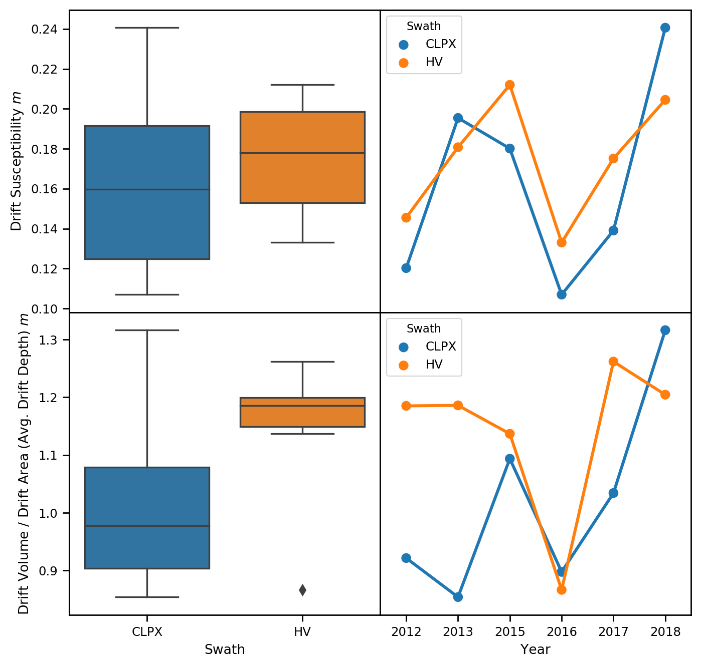
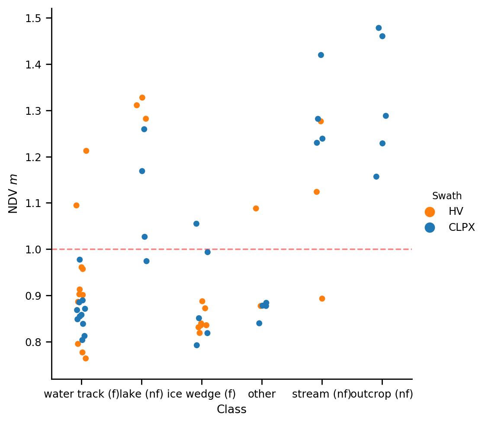

# Snowdrift Landscape Patterns: An Arctic Investigation

## Table of Contents

## Abstract
Between 2012 and 2018 we mapped the near-peak seasonal snow depth across two swaths in Northern Alaska using aerial structure-from-motion photogrammetry or lidar surveys validated by over a hundred thousand ground-based measurements. We introduce a quantitative method for identifying drifts and produce a drift census and find that on average 15% of the area was covered by drifts and these contained 40% of the snow-water-equivalent. We then identified six landscape based classes of either filling or nonfilling drift. The year-to-year fidelity of drifts is extremely high, though there are differences across the classes. The landscape filters the variability of each winter and funnels the unpredictable winter weather trajectories toward a convergent, cumulative result: the snow patterns and snowdrift classes seen here. The length of our time series, large number of ground validation points, and novel application of fidelity metrics show that convergence is perhaps the rule, not the exception, and that in the Arctic where drifts are particularly long-lying, the snow depth patterns of drifts (and scour) are a stable landscape for the ecological and hydrological processes of the Arctic.

## Introduction

Arctic snowdrifts are prominent landscape features that can extend for several kilometers and be on the order of 15 m deep. Decades of Arctic snow research (Benson, 1982; Benson and Sturm, 1993; Sturm and Wagner 2010; Sturm and Stuefer, 2013) suggest that these massive drifts form every winter, and summer imagery (Lauriol et al., 1986; Macander et al., 2015) reveals that they often persist until July. For two-thirds of the year these massive drifts are the landscape itself. The presence and landscape equivalence of these large and lingering drifts extends beyond the Arctic, through the Rocky Mountains (Winstral et al., 2002; Hiemstra et al., 2006) of North America, to the Sierra Nevada (Kirchner et al., 2014), across the American prairies (Pomeroy et al., 1993; Lapen and Martz, 1996), and to the high basins of the European Alps (Fohn and Meister, 1983; Schmidt 2009) and Spanish Pyrenees (Mases et al., 1998; Revuelto et al., 2014) and many other locations.

###### *Figure 1. Drifts on the North Slope of Alaska, May 25, 2019. The broad white areas are lakes frozen but largely snow-free. The sinuous white areas are ribbon drifts formed in the lee of river cutbanks, lake edges, and bluffs. They range from several to more than 15 m deep, and from 0.5 to over 5 km in lineal extent.*

The impact of these snowdrifts on the landscape is not limited to just the drift areas: it extends to conjugate scour zones that invariably form upwind, the source of the additional snow. These scour zones can be several hundred meters wide and tens of kilometers long. They serve important ecosystem functions for animals, for example allowing easy travel and winter grazing for caribou (Pruitt, 1959). At the same time, they create trafficability issues for oil and gas exploration, which is performed in winter and requires sufficient snow to avoid damage to the underlying tundra (Felix and Raynolds, 1989; Sturm et al., 2019).

It has been customary to treat snowdrifts and their scour zones as a component of the seasonal snow cover, basically either areas of deeper than normal snow, known to contain more water and melt slower, or (scour zones) just the opposite, but neither separate from the rest of the snow pack. In this paper we treat these drifts as quasi-permanent landscape features, and consistent with that view, explore their geometry and distribution just as we might for other landscape features such as cirques, tors, or nivation hollows. As one rationale for taking a landscape perspective, we present multi-year data on the annual reoccurence and similarity (which we define as *fidelity*) of Arctic drifts that confirms and strengthens the view that these are quasi-permanent landscape features. In the same spirit, we use detailed multi-year snow depth maps to produce a drift census of size, type and setting. Census results suggest that over 40% of the winter snow water equivalent (SWE) is stockpiled in drifts, although the census falls short of being a complete regional inventory. We conclude based on their size, duration, and amount of water contained in these drifts that they warrant this landscape viewpoint. Finally, we examine why drift fidelity is so high and analyze the relationship between these snowy features and the underlying snow-free landscape on which they form.

The drifts and scour zones create distinctive patterns on the landscape through the spatial arrangement of the two contrasting elements (or snow facies). These patterns are important because they spatially segregate snow-water resources and snow-related ecosystem services into distinctive zones. For instance, snow run-off in scour zones occurs in spring when the ground is still frozen, limiting infiltration, while melt water from drifts is delayed until summer when the ground has thawed and infiltration can occur. The drifts also tend to preserve the amount of snow that has fallen. Once blowing snow is stockpiled in a drift, it is removed from the transport system and thereby protected from the high (upwards of 40%) sublimation rates that accompany blowing snow (Essery et al., 1999; see also Pomeroy et al., 1997; Liston and Sturm, 1998) which is concentrated in scour zones. The conservation function of snowdrifts has recently been observed in the Himalaya (Stigter et al., 2018) where a strong anti-correlation between the spatial distribution of sublimation intensity and the distribution of drifts was found.

## Background

The connections between snow, wind transport, and topography, while well known, are still not fully understood, perhaps because the simplicity of the triadic relationship shown in Figure 2 masks surprising layers of complexity. One complexity has to do with drift-available snow, which differs from the amount of snow actually present. The latter amount is the sum of winter precipitation (*P*) minus (or plus) transported snow (*T*), less sublimated snow (*S*), and less the snow trapped by vegetation (*V*). But the drift-available amount is more a function of the wind shear stress and the spatial distribution of the surface snow adhesion. The latter has proven difficult to measure or model because snow adhesion varies with grain characteristics and sintering, a temperature-dependent aging process that can be wildly heterogenous. It is not surprising, therefore, that prior studies have documented over a 10X range in transport rates at any given wind speed (Sturm and Stuefer, 2013), a spread largely reflecting a wide range of surface snow conditions and therefore snow availability.

###### *Figure 2. The triadic relationship between snow availability, wind, and topography.*

The connection between wind transport and topography (gullies, river cutbanks, hillslopes, ridgelines, etc.) in principle is simpler: snow is deposited wherever the separation angle between wind streamlines and ground slope is sufficient to produce a local reduction in wind shear stress. But the finer details of this relationship are complicated by the turbulent nature of the wind when it blows over complex terrain. Eddies, rotors, and veering of the wind all take place. Local wind patterns are hard to measure, hard to visualize, and hard to model, yet they directly affect drift geometry. Additionally, as drifts grow and change through the winter, their form begins to affect the wind fields around them: one might say that the drifting snow never encounters the same landscape twice. So consistent with our landscape view of drifts, we invert the question of the linkage on this leg of the triad by asking the simpler question: "What does the drift form and geometry tell us about the wind and snow transport?"

Historically, the connection between transport and topography has been studied using either a profile or a planimetric perspective. Engineers, faced with preventing railways and roads from being buried by drift (*cf.* Moore, 1922) sought optimal road cut profiles. Finney (1939), based on a combination of wind tunnel experiments and direct observations, concluded that for cuts steeper than 14&deg; rotor eddies would form and deposit drifts that would clog the road. Rikhter (1954) and Kuz'min (1963) extended this work to more complex profiles, and the approach culminated in 1975 when Tabler, on the basis of 17 drift profiles from Wyoming and Colorado, developed an empirical profile regression model based on upwind and downwind surface slopes. He also introduced the term 'equilibrium profile' to describe the profile of a drift that cannot grow any more because the deposited snow has filled the catchment and eradicated the separation angle necessary for deposition. Tabler's equilibrium drifts are analogous to Cornish's (1902) *complete* (vs. *incomplete*) drifts, and Sturm and Benson's (1993) *filling* (vs. *non-filling*) drifts. Benson (1981), recognizing that if a drift was not filled, it could be used to measure the total winter flux, began an annual series of surveys to monitor drift volume in NW Alaska that has been continued sporadically since then and is the longest drift size/profile record from the Arctic.

The planimetric (mapping) approach has been used to investigate the distribution of drifts on the landscape. Kirnbaur (1991), Konig and Sturm (1998), Grayson et al., (2002), Winstral et al., (2002), and Parajka et al., (2012) all used aerial surveys to map drifts in plan view. A few planimetric studies (Klapa, 1980; Lauriol et al., 1986; Watson et al., 1994) tried to use aerial photos to produce a drift census, the goal being to use the change in drifts over time as a climate indicator. A few studies also used the planimetric approach (Luce and Tarboton 2004; Sturm and Wagner, 2010; Qualls and Arogundade, 2013) to quantify the annual fidelity of drifts.

Combining planimetric and profile approaches has until now been hampered by: 1) the lack of a quantitative definition of what constitutes a drift, 2) the lack of any way (other than laborious hand-probing) to map drift depth, and 3) the lack of algorithms for quantifying drift fidelity. Airborne lidar and structure-from-motion (SfM) snow depth mapping techniques have solved the second problem, and mapping is now becoming possible using satellites. More robust methods of image (i.e. pattern) comparison have been developed, in large measure due to digital image processing needs (see Chow and Paramesran, 2016), solving the third. Finally, we introduce a novel, quantitative definition of a drift.

## Field Areas

From 2012 through 2018 (except 2014) we conducted airborne structure-from-motion or lidar mappping of the snow depth annually across two swaths (CLPX and Happy Valley (HV)) in the foothills province of the Brooks Range in Northern Alaska (Figure 3). Physiographically, these swaths span two types of terrain: (1) undulating, broad piedmont hills cut by abundant immature stream networks (i.e. water tracks), and (2) more rugged and rocky terrain with cliff bands (Table 1). Both swaths are tundra with some shrub-tundra and larger shrubs in riparian zones. The snow cover (excluding drifts) tends to be thin (< 0.6 m), comprised of six to ten layers, forms in September and lasts through May (see Benson and Sturm, 1993). Basal layers of depth hoar fill the inter-tussock spaces and are typically capped by one or more wind slabs. Prevailing winter winds come from the south in the CLPX swath, and from the west in the HV swath. The snowdrifts form in water tracks, along river and stream cutbanks, along the edges of inset lakes, and below outcrops of flat-lying or slightly dipping sedimentary rocks. Prior information on drifts in the area can be found in Evans et al., 1989; Sturm et al., 1995; Sturm et al., 2001; Walker et al., 2001; Liston and Sturm, 2002; Sturm and Stuefer, 2013).

###### *Figure 3: The study area in northern Alaska. The inset shows the location of the CLPX and Happy Valley (HV) swaths.*

###### Table 1. CLPX and HV Physiography
|  Swath |  % Area with Slope  0&deg; to 5&deg; |  % Area with Slope 5&deg; to 10&deg; |  % Area with Slope 10&deg; to 15&deg; |  % Area with Slope 15&deg; to 30&deg; |  % Area with Slope above 30&deg; | Mean Elevation m | Std. Dev. Elevation m | Total Area km2 |
|:----:|:----------------------------------:|:--------------------------------:|:-----------------------------------:|:-----------------------------------:|:-----------------------------------:|:--------------------:|:-------------------------:|:-------------------:|
| CLPX | 70.2 | 22.7 | 3.7 | 3.2 | 0.3 | 861.6 | 53.4 | 96.5 |
| HV | 84.5 | 14.4 | 0.8 | 0.1 | 0.1 | 382.0 | 22.8 | 29.0 |

## Snow Depth Mapping Methods

Snow depth mapping was done using SfM photogrammetry (2015 though 2018) or lidar (2012 and 2013) and then adjusted to ground-based measurements (Figure 4). The area mapped each year was about 130 km2. To produce the maps, we: (1) conducted an airborne survey (snow-free) in June that was used to produce a snow-free digital elevation model (DEM) for each swath, (2) conducted multiple airborne surveys at near-peak snow cover each April that were used to create digital surface models (DSMs) of the snow cover, then (3) generated annual high resolution (1 m) snow depth maps by subtracting the DEM from the DSMs. Six such depth maps were produced for each swath between 2012 and 2018, comprising over 600 million individual geospatial snow depth records. The hardware, software, and processing steps used to go from the airborne survey data (photos or lidar returns) to snow depth maps is described in Johnson et al. (2013) and in Nolan et al. (2015).

###### *Figure 4: An example (from HV) of the snow mapping that forms the basis of this study. From left: a) the summer snow-free landscape b) a topographic hillshade map, c) a snow depth map, and d-g) two insets showing two (out of six) classes of drifts from the drift census: top: ice wedge drifts; bottom: water track drifts.*

Acquiring the snow-free DEM required careful timing because tundra plants leaf out before all snowdrifts melt. We acquired an initial DEM using airborne lidar in 2012 and a second DEM using SfM in 2017. Both were acquired in early June, but in 2017 remnant snowdrifts covered some important parts of the field area. The 2017 DEM, however, was derived from a denser point cloud and therefore better quality where not obscured by snow. The two DEMs were ultimately fused together to leverage their respective strengths and make a single snow-free DEM.

The snow depth maps were field-validated and adjusted using 141,207 ground-based probe measurements collected concurrently with the airborne surveys. Differences between snow depth maps (raster data) and field probe measurements (vector data) arise from errors in converting point clouds to gridded surface models and from geolocation errors in both sets of data. The probe measurements, which use a WAAS-corrected GPS, have a positional uncertainty of ± 2.5 m and a quasi-random vertical depth uncertainty ranging from 0 to 0.05 m caused by a tendency to 'over-probe' down into the substrate below the snow (Sturm and Holmgren, 2018). The DEMs and DSMs have a position uncertainty estimated to be ± 0.30 m (Nolan et al., 2015), resulting in snow depth pixel locations accurate to about ±0.40 m. Without correcting either pixel or probe positions, we overlaid and differenced the two measurement sets for each swath and survey (Figure 5; see also Deems et al., 2013). Mean differences between probe and snow depth map values ranged from -0.06 to 0.40 m (Table 2). These offsets arise from the combination of positional and vertical errors, as well as noise in the GPS signals that accumulates over the course of the airborne surveys. As described by Nolan et al., (2015), we applied a global affine transformation to reduce the mean difference (probe minus snow depth map) value for each survey to zero. Once adjusted, the resulting snow depth maps are accurate to about ±0.10 m, which with respect to delineating drifts (which are easily 20 times deeper) is insignificant. The resulting accuracy of the snow depth maps is comparable to that of other airborne snow depth mapping efforts (e.g. Deems et al., 2013; Buhler et al., 2015a; Nolan et al., 2015; Vander Jagt et al., 2015; De Michele at al., 2016; Buhler et al., 2016; Harder et al., 2016).
Check: Currier 2019, Deems 2008,  Westoby 2013,  Painter?)

###### *Figure 5: The 2015 field validation campaign for the CLPX swath. 8,308 ground measurements (black circles) were used to validate and adjust the snow depth map (Table 2). Note the extensive stream cutbank and lake drifts (and scour) in the eastern end of the swath.*

###### Table 2. Field Depths (Vector) Minus Snow Depth Maps (Raster) Prior to Correction, All Years.

| Year | Swath | Count | Mean | Std. |
|:-----:|:------------:|:------:|:-----:|:----:|
| 2012 | CLPX | 32571 | 0.16 | 0.12 |
| 2012 | Happy Valley | 24601 | -0.04 | 0.16 |
| 2013 | CLPX | 27555 | 0.21 | 0.11 |
| 2013 | Happy Valley | 11718 | -0.03 | 0.16 |
| 2015 | CLPX | 8308 | 0.36 | 0.14 |
| 2015 | Happy Valley | 7030 | 0.18 | 0.14 |
| 2016 | CLPX | 11410 | 0.38 | 0.11 |
| 2017 | CLPX | 6165 | 0.4 | 0.15 |
| 2017 | Happy Valley | 5797 | -0.05 | 0.18 |
| 2018 | CLPX | 4178 | 0.25 | 0.18 |
| 2018 | Happy Valley | 1874 | -0.08 | 0.5 |
| Mean |  | 12837 | 0.16 | 0.18 |
| Total |  | 141207 |  |  |

## Results
### A General Snowdrift Census
In order to conduct a snowdrift census, we needed to define a drift in a manner that could be automated and took into account the inter-annual variability. Broadly, a drift is an area where there has been an additional accumulation of snow deposited by the wind, but how much additional accumulation indicates a drift, and how can we be sure (in planimetric mode) that the greater accumulation is actually a function of *T* rather than *P*? Researchers routinely recognize drifts in the field[^1] , but that identification relies on layers of spatial and visual information including geometry, wind texture, and shadowing, factors difficult to derive from remote sensing products. Here our first step is to define a drift in an area of interest (AOI) using a snow depth threshold determined by testing the response of two functions as we change that threshold: F1 - the percentage of the AOI covered by drifts (%DA), and F2 - the percentage of total snow volume in the AOI contained in the drifts (%DV). To illustrate the procedure we construct a synthetic AOI with normal snow depth distribution with a mean (&mu;) of 0.50 m and a standard deviation (&sigma;) of 0.20 m (Figure 6).

###### *Figure 6: Setting the drift depth threshold using depth and volume cumulative distribution curves.*

If the drift threshold is set at zero depth, then 100% of the area would be classified as drift and all the snow volume would be stockpiled in those drifts, a nonsensical result. As the threshold increases, both %DA and %DV decrease as expected, but at different rates, and the difference between the two increases, reaches a maximum which occurs for this synthetic example at the mean depth, and then begins to fall. The *rate* at which the %DV-%DA difference changes (the derivative of the F2-F1 difference function) has two inflection points, the second at 0.70 m, and it is here we set the drift threshold. This point is also the minimum of the derivative of the probability distribution function for the synthetic AOI (top, Figure 6). In this normally-distributed example, the threshold is exactly 1&sigma; greater than the mean depth, though in real AOIs F1 and F2 are more complex and the value can differ from 1&sigma;. It is encouraging to note, however, that prior to using %DA and %DV to define the threshold, we actually used (&mu;+1&sigma;) as an informal threshold. For real field data, AOIs must be large enough to encompass the full range of measured snow depths, and the observed F1 and F2 functions are numerically differentiated (NumPy REF). We have tested the method against numerous visual observations of drifts in the field and find it produces reasonable (and programmable) results.

Applying the drift definition to the 12 snow depth maps from the CLPX and HV swaths produced a binary drift/no-drift map for each swath and year, then statistics from these were compiled to produce the census in Table 3. On average 15% of the area in both swaths was covered by drifts and these contained 30% of the snow by volume. Drift snow density in the field area exceeds 0.40 g/cm3, while non-drift snow density varies from 0.25 to 0.35 g/cm3 (REFS), so conservatively we estimate that over 40% of the snow mass in the field area was contained in drifts (30% * [0.4 / 0.3]) for both swaths.

A key metric from the census is the *drift susceptibility*, shown graphically in Figure 7. The metric, computed by dividing the total drift volume (m3) by the total mapped swath area (m2), essentially reports the additional depth of snow (m) that would be present over the entire swath if all drift snow was mined out and redistributed evenly. It is useful because it allows comparison between map areas of different sizes.

###### Table 3. Drift Census, CLPX and HV Swaths. (Charlie computations, 10/29).
| Year | Swath | Snowdrift Depth Threshold *m* | %DA | %DV | Total Drift Area *m2* | Total Drift Volume *m3* | Drift Susceptibility *m* | Mean Drift Depth *m* |
|:----:|:-----:|:-----------------------------:|:-----:|:-----:|:----------------------:|:------------------------:|:-------------------:|:--------------------:|
| 2012 | CLPX | 0.65 | 7.88 | 20.14 | 12158887 | 11202504 | 0.12 | 0.92 |
| 2012 | HV | 0.72 | 12.27 | 30.18 | 2325701 | 2756461 | 0.145 | 1.19 |
| 2013 | CLPX | 0.68 | 13.78 | 22.38 | 21703191 | 18528296 | 0.195 | 0.85 |
| 2013 | HV | 0.77 | 15.24 | 32.91 | 3151244 | 3737648 | 0.181 | 1.19 |
| 2015 | CLPX | 0.82 | 16.47 | 32.91 | 15718826 | 17190050 | 0.18 | 1.09 |
| 2015 | HV | 0.85 | 18.65 | 29.94 | 5320028 | 6047839 | 0.212 | 1.14 |
| 2016 | CLPX | 0.65 | 11.92 | 23.1 | 11109247 | 9969117 | 0.107 | 0.9 |
| 2016 | HV | 0.63 | 15.36 | 25.39 | 4032467 | 3492941 | 0.133 | 0.87 |
| 2017 | CLPX | 0.75 | 13.45 | 27.87 | 12676978 | 13109179 | 0.139 | 1.03 |
| 2017 | HV | 0.8 | 13.88 | 32.75 | 3861865 | 4873657 | 0.175 | 1.26 |
| 2018 | CLPX | 0.86 | 18.28 | 41.84 | 17139872 | 22564338 | 0.241 | 1.32 |
| 2018 | HV | 0.73 | 16.98 | 41.88 | 4743599 | 5713938 | 0.205 | 1.2 |

*Note: The CLPX swath (96 km2) was 3.3X larger than the HV swath (29 km2) (Table 1) and this sample size difference is reflected in the area and volume values, but not the percent values. Total mapped area varied slightly from one year to the next due to flight line variations.*

The fact that area and volume percentages for the CLPX and HV swaths were so similar suggests the two swaths experience about the same amount of wind transport and stockpile about the amount of snow in drifts, which is not surprising given that they are near each other. However, the nature of those drifts must be different give the differences in the underlying swath physiographies (Table 1). Evidence suggesting this is the case is also found in the variance of the drift susceptibility values for the two areas: the year-to-year CLPX variance is nearly twice that of the HV swath, suggesting greater year-to-year variability in drift trapping in the CLPX swath, despite similar overall amounts.

In the next section we confirm these differences arise due to differences in the landscape type of drifts by classifying the drifts in a second census.

###### *Figure 7: Drift census results. Drift susceptibility for the CLPX and HV swaths. Note that the range of of drift susceptibility was nearly twice as large for CLPX as for HV.*

### Snowdrift Classification & Census
Starting again with binary drift/no-drift maps created using the threshold algorithm (Figure 6), we introduced additional concepts of connectivity and fidelity in order to better define and classify drifts. For every 1 m2 pixel in the drift/no-drift maps that had been classified above threshold, we determined the number of winters where the drift had been so classified (e.g., for 5 of the 6 winters), then color-coded that pixel to represent this value. This procedure allowed us to collapse all six years of results to a single composite fidelity map. We then searched the fidelity map for areas where there were contiguous and distinctive blocks of pixels, all with high fidelity (> 80%). These we outlined manually and the resulting areas provided the basis for the drift classification. Finally, for all such blocks, we examined the association of the drifts with the underlying "green" landscape[^2]. When completed, the process yielded 59 drifts that had recognizable form and a clear association with an underlying landform. The six classes that emerged were: water track drifts (n=22), stream fill drifts (n=7), ice wedge drifts (n=12), outcrop drifts (n=5), lake drifts (n=7), and "other" (no clear landform association, n=6). The census for these drifts appears in Table 4)

###### *Figure 8: Six classes of snowdrift. Red polygons are the manual delineation of the drift features.*

The underlying "green" landforms with which the classes were associated are well-known across the Arctic. Water tracks (Figure 9, c.f. McNamara et al.,  1998; Trochim et al., 2016; Paquette et al., 2017) are lightly incised hillslope drainage pathways that show little branching and are controlled by permafrost. They are frequently found in networks of linear or curvilinear drainages, often running down a hillslope in near-parallel paths. In winter the tracks generally are filled (a.k.a. equilibrium (Tabler, 1975) or complete (Cornish, 1902)), but because the tracks rarely occur in isolation, upwind water tracks (before they are filled) can rob downwind water tracks of wind-blown snow, leaving these unfilled. It is when water tracks lie closer together than the full equilibrium fetch distance (Tabler, 1975?) that a downwind water track will be starved for flux. This situation will persist through the winter until the upwind track has reached its equilibrium profile and ceases to trap snow. While it remains speculative, the quasi-regular spacing of water tracks across a hillslope like that in Figure 9 suggests winter drifting and track spacing are related through this mechanism. The feedback to the underlying tundra would be that the spring snowdrift melt would flush the track with maximum run-off each year and contribute to its incision through both thermal and physical erosion (Trochim et al., 2016).

###### *Figure 9: Regularly spaced water tracks in the HV swath. The upper panorama shows 9 nearly parallel tracks with the darks areas between the tracks thin snow that has been cratered by foraging caribou. The blue depth profile indicates the tracks hold about 1 m of snow and ground observations suggest most of the tracks had equilibrium profiles (wind from the west (right side of image). The tracks tend to hold willow and birch shrubs and appear darker than the surrounding tundra in summer (bottom).* REFACTOR THIS FIGURE FOR SCALE, GEOREFERENCE, ORTHO.

Ice wedge drifts form in the network of troughs surrounding high-centered polygons (Black, 1952; Jorgenson and Osterkamp, 2005; Gamon et al., 2012). These troughs (which can be up to 1.5 m deep) develop because ice wedges thaw more rapidly than the permafrost in polygon centers. The drifts (Figures 9b and 11) occur on spatial scales of several to tens of meters, and the polygon centers are sometimes scoured free of all snow, producing an extreme variation in depth between ice wedge drifts and adjacent non-drift locations. Less abundant in our field area, ice wedge drifts are extensive across the Arctic coastal plain and in many places in the Arctic they are the predominant land and drift form. Like water track drifts, ice wedge drifts are generally filling drifts.

###### *Figure 10: Ice wedge drifts in the 1002 coastal plain area of the Arctic National Wildlife Refuge. The network of ice wedges holds snow; the polygon centers are partially bare. The drifts in the troughs here were over 1.5 m deep in places.*

Stream snowdrifts, sometimes called ribbon drifts (Figures 1, 9c, and 12), line the banks of creeks and rivers. These water courses are distinguished from water tracks by being larger, more incised, and most importantly, having sharper breaks in slope along channel edges. These sharper breaks are effective traps and can create long, deep snowdrifts. An oddity of the geography of northern Alaska is that many of the stream and river drainages trend south to north, while the winter winds are most often from the east or west, creating an ideal scenario for producing this class of drift. Consequently, some of these drifts can extend tens of kilometers (Figure 1). Many of these cutbank traps are deep enough and wide enough that they produce non-filling drifts, which was what motivated Benson (1983) to use this type of drift to measure winter wind-blown flux rates. But more correctly, these stream drifts can be filling or non-filling depending on their size and the total wind-blown flux for the winter. Wherever that flux exceeds the equilibrium trap volume, then the drift switches to a filling drift. In our experience, it is typically the stream width that determines this. If the stream is narrow enough, a drift will not only form in the lee of the windward cutbank, but also at the base of the opposite cutbank facing into the wind (a leading edge drift (Kuz'min, 1963)). When this happens and these two drifts coalesce, then the combined drift quickly fills to the equilibrium profile (Benson and Sturm, 1992; Figure 2).

###### *Figure 11: A stream drift in the Brooks Range. The wind is from the right (west) and has been moving snow into this side of the stream over the winter, but has not yet, and is unlikely to, fill the drift trap by winter's end.*

Unlike the more linear drifts formed by water tracks and streams, lake snowdrifts tend to be crescentic (Figures 1, 13, and 9d). Many of the lakes in northern Alaska are incised and have a quasi-circular shape. Given that shape, they (in principle) could trap wind-blown snow from all directions and so produce a 'flux rose' in the form of lake drifts from all directions. More often, there are prevailing winds from one direction and these produce a crescentic drift on one side of the lake while on the opposite side there is a scour zone (Sturm and Liston, 2003; Rees et al., 2013). Filling lake drifts form a smooth 'apron' with a near-constant slope while nonfilling lake drifts often have sharp, corniced edges followed by a sheer drop to the ice below.

###### *Figure 12: A crescentic lake drift in CLPX. The snowmobile is near the edge of this near-circular lake; the depression to the left below the cornice is the snow-covered ice surface. This drift was 5 m deep.*

Outcrop snowdrifts (Figure 8e) occurred only in the CLPX swath in our study. In that swath tilted or flat-lying rock ledges (geologic map REF) were exposed in several areas. This produced two kinds of drifts based on the orientation of the outcrop and the transport wind: leading edge drifts that form against the base of windward facing cliffs (REF), and sheltered drifts that formed downwind of steep leeward faces. This second kind of drift is essentially the same as a non-filling stream (or ribbon) drift as described above, though often the outcrops are shorter, less linear, and have more convoluted potential drift traps in planimetric view.

The last class, "other" (Figure 8f) were those drifts from the sample set that had no obvious topographic association. These were most often found on hillslopes with mild grades of only a few degrees and formed irregularly-shaped patches, suggesting that perhaps some subtle upwind topographic feature had created enough flow separation to trigger snow deposition.

###### Table 4: Mean Drift Class Statistics by Swath.

| Swath | Class | Drift Area m2 | Mean Depth m | Drift Volume m3 | Std. Depth m | CV Depth | NDV m |
|:-----:|:---------------:|:----------------:|:--------------:|:------------------:|:--------------:|:--------:|:-------:|
| CLPX | ice wedge (f) | 369 | 0.89 | 350 | 0.11 | 0.12 | 0.9 |
| HV | ice wedge (f) | 850 | 0.84 | 720 | 0.1 | 0.11 | 0.85 |
| CLPX | lake (nf) | 23832 | 1.11 | 26790 | 0.25 | 0.22 | 1.11 |
| HV | lake (nf) | 71678 | 1.31 | 93953 | 0.3 | 0.23 | 1.31 |
| CLPX | other | 212890 | 0.87 | 186951 | 0.13 | 0.15 | 0.87 |
| HV | other | 12722 | 0.98 | 11357 | 0.19 | 0.19 | 0.98 |
| CLPX | outcrop (nf) | 5431 | 1.32 | 7522 | 0.35 | 0.26 | 1.32 |
| HV | outcrop (nf) | N/A | N/A | N/A | N/A | N/A | N/A |
| CLPX | stream (nf) | 20247 | 1.29 | 25458 | 0.32 | 0.25 | 1.29 |
| HV | stream (nf) | 2182 | 1.1 | 2420 | 0.29 | 0.26 | 1.1 |
| CLPX | water track (f) | 2287 | 0.87 | 2056 | 0.1 | 0.11 | 0.86 |
| HV | water track (f) | 20967 | 0.93 | 20216 | 0.28 | 0.31 | 0.92 |

Broadly, the six classes can be divided into filling (*f*) and non-filling (*nf*) drifts (Table 4 and Figure 13). Not surprisingly, non-filling drifts were deeper than filling drifts, and as consequence, had higher mean depths within the drift (i.e. area-normalized drift volumes (NDV)) because they could trap more snow per unit area. The NDV metric for a particular drift on a particular date, in a sense, is a measure of how filled that drift is with respect to what would be normal for that class of drift. For example, a lake drift measured at NDV=1 would be under-performing for that class of drift, but a water track drift with the same NDV would be unusually deep for that class of drift. There should theoretically be a maximum NDV (NDVmax) for a given drift that is reached when the drift is filled (i.e. at equilibrium) and is related to the topographic profile of the snow-free surface). If we knew NDVmax for a drift, we could know how far from being full the drift was at the time it was measured (i.e. how much more flux the drift can stockpile). While NDVmax undoubtedly varies with the specific drift and local underlying topography, we suspect it could only vary over narrow limits for each class of drift, which then might be a practical result when trying to estimate snow volumes and/or masses for a specific landscape.

###### *Figure 13: NDV values (snowdrift volume-to-area ratios) for six classes of drifts. The red dashed line roughly separates filling from non-filling drifts.*

The coefficient of variance (CV) of drift depth by class (Table 4 and Figure 14) suggests the type of depth distribution curves one might find within each drift class. For example, ice wedge drift CV values are low and similar for both swaths, suggesting fairly uniform depths in these drifts with little difference due to location. This makes sense: the box-like shape of ice wedge troughs, a product of subsurface thawing, ensures that most snow depths in such a drift will be similar, and the overall depth (about 1.5 m) is driven by the regional climatic warming, not local micro-climates. On the other hand the range of CV values for water track drifts is distinctly different for the two swaths, with the HV water track drifts showing considerably more variability. The drift snow depth in these features is a complex function of the length of the hillslope, the active layer thickness, slope, aspect, and perhaps the amount of snow in the upwind water tracks as well. The 2X range in CV values suggest that the HV water tracks have different characteristics than the CLPX ones, which a visual inspection of the snow-free swaths suggests is true.

###### *Figure 14. CV values by drift class.*

We have regressed drift volume against drift area for each class (Figure 15). The slopes of these lines, ranging from 0.86 (ice wedge) to 1.56 (outcrop) are once again the predicted average drift depth for a drift in that class (i.e. the NDV). The range in slopes indicates that *nf* landscapes are better "primed" to trap snow than *f* landscapes. A slope value of around 1.1 appears to be the transition value between *f* and *nf* drifts. If all these drift classes existed on the same scale as they are portrayed in Figure 15, the *nf* type drifts would likely have even steeper slopes as they would be closer to their theoretical NDVmax.

###### *Figure 15. Least-squares linear regression of drift volume by drift area by snowdrift class. Best fit lines (slopes in legend) are plotted on common range with y-intercepts set to zero for comparison purposes.*

### Snow Pattern Fidelity

###### *Figure 16: The same area shown in Figure 9 but now in planimetric view showing an exceptional level of fidelity over six years. Note that in some cases even fine details (order 1 m) are preserved. The fidelity shown here is in part due to the fact that this is a hillslope cut by filling water tracks.*

The fundamental basis for treating drifts as landscape features is that they appear every year in the same place and with much the same shape as shown in Figure 16. But where is that most true, and what is the relationship between drifts and scour zones? Drift fidelity has been noted in prior studies (Sturm and Wagner, 2010; REFS), but established in a somewhat qualitative fashion. Here we apply four fidelity metrics from the field of image quality assessment (see Eskicioglu and Fisher, 1995; Thung and Raveendran, 2009) to snow depth maps in order to compare changes from one year to the next (e.g. 2012 vs. 2013, 2012 vs. 2015, etc.). For uniformity, all metrics have been rescaled from 0 to 1, with 1 indicating perfect fidelity (e.g., an exact repeat). The metrics are:

**1. Normalized Mean Square Error (NRMSE):** NRMSE is sensitive to individual pixel-wise differences in two patterns, but not to larger structural differences. Consequently, at the downwind edges of non-filling drifts, zero scores will be recorded while values closer to 1 are likely at the upwind edges. NRMSE alone is not as useful for determining whether or not different structures (drift or scour elements) are present. We employ NRMSE (REF) for reference and for historical continuity in our field area (see Sturm and Wagner, 2010). NRMSE yields both a global value for an AOI (the mean of all individual pixel values) and a map of overall pattern fidelity for each pair of images compared.

**2. Structural Similarity Index Method (SSIM):** The SSIM metric (Wang et al., 2004) is computed using convolution matrices that compare snow depth, the standard deviation of snow depth, and structural information (the covariance of the two snow depth maps). Created to more closely mimic the human visual system, SSIM is tuned to local areas of strong spatial correlation, a hallmark of drift and scour patterns. Snow depths within these pattern elements are locally correlated. This structural sensitivity means that SSIM is useful for highlighting the emergence or disappearance of drift or  scour elements between two snow depth maps and likely indicating a change in flux or flux direction.

**3. Complex Wavelet Structural Similarity Index Method (CW-SSIM):** Implementing SSIM in the complex wavelet domain (Wang and Simoncelli, 2005) yields a metric that is insensitive to geometric distortions that are smaller than the width of the wavelet used in the transformation. A pattern can be shifted, rotated, etc., without influencing the fidelity score. CW-SSIM yields a global index value that is useful, but the map of CW-SSIM values only reflects the periodicity of the wavelet.

**4. Gradient Magnitude Similarity (GMS):** GMS (Xue et al., 2014) computes the pixel-wise difference between gradient (derivative) magnitude maps via a Prewitt kernel convolution in both the x any y directions, thereby removing the effect of global variation in depth. GMS returns a global index value and similarity map. Because GMS is comparing gradients, it allows us to see how snow depth transitions (snow depth rates of change) are different across two snow depth maps. Similar to NRMSE, this will highlight changes at the edges of snowdrifts.

The four metrics allow us to mimic the skill and nuance of the human eye while also quantifying the year-to-year fidelity (Figure 16) along a novel and more continuous scale. Applying this method to all of our year-pairs (Table 5) we find that a) confirming our visual observations, absolute fidelity levels are very high, b) all metrics report higher fidelity for drifts that typically fill, a point discussed later; and c) conversely scour zones tend to show the lowest fidelity scores, though there are some contradictory results in some of these areas. NRMSE tends to indicate the highest fidelity in thin and scoured areas adjacent to the water track drifts, while SSIM does just the opposite. CW-SSIM and GMS are more complex and suggest a cross-wind/cross-drift alteration of higher and lower fidelity scores. This behavior indicates the main loci of the drifts are in the same place, but the drift profiles show some variation in where the deeper and shallower areas can be found. 

###### Table 5. Mean fidelity results by swath (top) and relative fidelity percentile ranks for each AOI comparison pair derived from the mean value of all all four metrics (bottom). Higher percentiles indicate greater fidelity compared to the other observations.

| Swath | NRMSE | SSIM | CW-SSIM | GMS | Avg. Similarity Score |
|:------------:|:-----:|:----:|:-------:|:----:|:---------------------:|
| CLPX | 0.61 | 0.82 | 0.82 | 0.85 | 0.77 |
| Happy Valley | 0.71 | 0.87 | 0.85 | 0.87 | 0.83 |

###### *Figure 17. Results of the four metrics computed for 2016 and 2017 HV water track snow depth maps (same area as Figures 10 and 17). Note that the CW-SSIM map pattern only reflects the wavelet width parameter. For uniformity, all metrics have been rescaled from 0 to 1, with 1 indicating perfect fidelity (e.g., an exact repeat).*

###### *Figure 18: A comparison of the 2012 and 206 depth maps from a CLPX Lake Drift, which is the worst performing fidelity case. Two profiles across the depth maps and fidelity results are drawn: one transect (red) runs south to north across a small stream drift that is connected to the lake drift, and the second transect (magenta) runs to the northeast across a lake drift parallel to the dominant flux direction.*

The comparison between 2012 and 2016 reveals the convergence in pattern between a rich snow year in 2012 (perhaps greater *P*) and a thinner snow year in 2016, perhaps a function of less *P* or increased *S* due to strong katabatic winds. Despite the differences in the depth maps and profiles (Figure 18) the depth threshold for snowdrift was computed to be 0.65 m for each year. With the 0.65 m threshold we can bracket the fidelity profile lines for where they overlay a drift in 2012 (yellow) or in 2012 and 2016 (green). These shaded areas show downwind-edge "fringe" changes that are discussed later, and it is these changes in snowdrift form that cause *nf* drifts to have poorer fidelity compared to *f* drifts.

## Discussion
The drift census (Table 3) confirms that drifts are hydrologically important in at least the part of the Arctic where the study was conducted. While the area that the drifts occupied was only 15% of the landscape, it was over 40% of the winter water. Even from this limited sample we can see that drift areas can be two to or more times more important with respect to runoff than non-drift areas (a SWE to area ratio of 2.6). This is not a new finding, but until now we have lacked an automated computational method of defining drifts so drift statistics have not been collected. The method (Figure 6) for delineating drifts is novel and while perhaps not yet optimal, in this first application it appears to have produced reasonable results that are consistent with qualitative "eyeball tests." Armed with a methodology for defining drifts, and a way to map them (airborne lidar or SfM), more drift census should become available in future years. When they do, we suggest based on many years of field observations that we will discover some drift-susceptible landscapes where drifts contain 50% or more of the SWE during the winter.

The general census (Table 3) revealed differences (Figure 7) between swaths (CLPX vs. HV), suggesting that the population of drifts in the two areas might be different in some way, and therefore that there might be different types of drifts present. These differences were particularly notable when we computed the drift susceptibility index for each swath (Table 3). The two swaths are not so far apart (<70 km) as to expect large climatic differences and they are large enough (97 and 29 km2) to preclude that the census differences are niche or local effects, or the impact of one or two large drifts in the sample. The most likely source of the difference appeared to be differing underlying physiographic features (Table 1) in the two areas that produced different populations. To test that idea, we subdivided the drifts into classes, some which are filling and others which are not. While the fill/non-fill differentiation (Cornish, 1902) and the relation to landform (Ekblaw 1918; Lewis, 1939) have been part of our understanding of drifts for over a hundred years, the new six-fold classification developed here (Figure 8) improves on those prior systems by relating *f* vs. *nf* directly to landform types (e.g. ice wedges vs. lake bluffs). In this way, the classification helps to link the planimetric view of drifts, which was how we derived the class census (Table 4), back to the profile view that dominated early road and railway transportation studies and is the classic way to think of *f* vs. *nf* drifts. The classes may eventually prove useful archetypes for refining the linkages between snowdrift (and scour), wind transport, and topography (the snowdrift triad, Figure 2). We realize that certain drift classes, like mountain cornices, were not in our field area and therefore do not yet appear in our census or classification system.

While in this work we have focused mainly on drifts, the scour zones, those conjugate areas linked to the drifts themselves, should also be thought of as landscape features, though more volatile and mobile than drifts. Our limited examination of these zones revealed that they had low year-to-year fidelity (e.g. Figure __), a finding we might have anticipated. If we think of a drift trap as a black hole for blowing snow, the trap lip is the event horizon: anything passing near the edge is drawn in and cannot escape and a convergent "sink" exists. A scour zone, in contrast, could be located in many different locations while still sourcing the same drift, and this seems to be borne out in the field. Small variations in winter wind directions and strength alter where the snow is scoured from, but in the end does not alter the drifts themselves. This insensitivity to wind direction is explicit in the modeling work of Winstral (2002) and (REFS?) where winds 45&deg; on either side of the bisecting ray from a drift are still considered "in-line" with the drift. But while they do not exhibit the same fidelity as drifts, as drift sources we think scour zones bear more attention in future studies, particularly those related to wildlife. The connections between scour zones and the drifts themselves also warrant greater study.

Within the drift classification system, the two types of drifts: *f* and *nf*, did not show the same levels of fidelity (Table 5). Lake, stream, and outcrop drifts tended to be of the *nf* type, while water track and ice wedge drifts of the *f* type. The latter showed higher fidelity because in every year of our study these filled and assumed a similar depth and geometry because *f* type drifts always have enough flux to fill, thus producing repeats with extremely high fidelity. The *nf* type, in principle, can change from *nf* to *f* with a sufficient increase in winter flux, but that does not seem to happen often in practice because the local climate tends to limit the total winter flux within a relatively narrow range. Dependence on the magnitude of the flux produces *nf* drifts that will be wider or narrower on their downwind axis, depending on how far they have grown out from the cutbank or bluff edge. More flux equals wider drifts, an effect well documented in Benson (1983) and Sturm et al. (199_). This down-wind extension produces a downwind fringe that changes from year-to-year that reduces the fidelity metrics at that location (e.g. Figure 18). However, it is possible that some setting exists where the flux and drift traps are well-matched such that in some winters they harbor *f* and in others *nf* drifts.

It is the extremely high year-to-year fidelity of drifts that makes a landscape approach to drifts meaningful. Clearly, if drifts varied greatly from one year to the next in location and/or geometry, the effort to characterize and count them would not be useful. But the fidelity, in fact, makes it both feasible and important to monitor drifts. The importance comes from the fact that they are hydrologically critical features in the Arctic, and they are also a strong climate index, one that reflects both wind and precipitation. To date, no historical records of drifts are long enough to be useful climate change series, but the advent of satellite-based measurements could soon make the collection of such series routine, and the results are likely to be quite informative with respect to Arctic climate trends.

So how is this remarkable constancy of drifts possible? Of the snowdrift triad (Figure 2) there are inherent amounts of variability: for simplicity, assume the top and left vertices (wind transport and available snow) are functions of the winter weather alone (ignoring their alteration by topography). Although for our field area (and for much of the snowdrift world) local meteorological data are not available, we know they are broadly bound by climate normals including the length of winter, number of storms, and prevailing wind vectors. Within these climatic bounds there is substantial variability. The trajectory of a single winter (the amounts and timings of *P*, *T*, and *S* events) is impossible to predict. The top and left vertices of the triad move - but the cumulative results converge on *f* and *nf* snow depth classes to produce a snow pattern of drift and scour that is essentially the same each year, and this convergence occurs because the right vertex of the triad (topography) anchors the the triad. Landscape filters the variability of each winter and funnels the unpredictable trajectories toward a convergent, cumulative result demonstrated by the snow patterns and snowdrift classes seen here. Convergence of snow patterns has a rich history (Matthes, 1900; Bloschl et al.,2002; Yasuaki et al., 2005; Sturm and Wagner, 2010), and now the length of our time series, large number of ground validation points, and fidelity metrics show that convergence is perhaps the rule, not the exception, and that in the Arctic where drifts are particularly long-lying, the snow depth patterns of various *nf* and *f* drifts (and scour) are the landscape itself.

# Conclusion
The capacity to measure snow depth from space is emerging (REFS), and so discerning drift from not-drift snow over large areas will be essential for snow hydrology. High resolution DEMs are also increasingly prevalent (e.g. the ArcticDEM) and so we have more knowledge than ever about the snow-free landscape which may be leveraged to find and measure potential *f* and *nf* drift traps, thereby constraining regional snow depth distributions, even if metereological data and/or snow depth measurements are sparse (e.g. ICE-Sat altimetry points on deep, high fidelity stream drifts). We now know that some landscapes are more optimized to stockpile snow in drifts than others based on the frequency and density of *f* and *nf* landscape features as seen in the drift susceptibility values of our swaths (Table 3). The landscape equivalence of snowdrifts is also perhaps why persistence mapping (Macander REF) is effective: aspect is important for drifting more so than solar exposure when it comes to persistence, and so there is great opportunity to leverage optical remote sensing products and existing persistence maps to predict snow depth distributions. Finally, snowdrifts are recursive. Nivation (REFs) processes may incrementally increase drift trap size and subsequently the snowdrift itself in a feedback loop that creates ever-larger drifts when flux is sufficient - a process which, unchecked, may be the genesis of a new ice age (Lauriol REF).

## References (DRAFT, needs cross-checking)

Benson, C. S., & Sturm, M. (1993). Structure and wind transport of seasonal snow on the Arctic slope of Alaska. Annals of Glaciology, 18, 261–267.
Cornish, V. (1914). Waves of sand and snow and the eddies which make them, 1–390. https://doi.org/10.5962/bhl.title.16375

Deems, J. S., & Painter, T. H. (2006). Lidar measurement of snow depth: accuracy and error sources. Proceedings of the 2006 International Snow Science Workshop: Telluride, Colorado, USA, International Snow Science Workshop, 330, 330–338.

Deems, J. S., Painter, T. H., & Finnegan, D. C. (2013). Lidar measurement of snow depth: a review. Journal of Glaciology, 59(215), 467–479. https://doi.org/10.3189/2013JoG12J154

Ekblaw, W. E. (1918). The importance of nivation as an erosive factor, and of soil flow as a transporting agency, in northern Greenland. In The Importance of Nivation as an Erosive Factor, and of Soil Flow as a Transporting Agency, in Northern Greenland (Vol. 4, pp. 288–293). Proceedings of the National Academy of Sciences of the United States of America.

Essery, Richard, Pomeroy, J. (2004). Vegetation and Topographic Control of Wind-Blown Snow Distributions in Distributed and Aggregated Simulations for an Arctic Tundra Basin. Retrieved December 11, 2015, from http://journals.ametsoc.org/doi/pdf/10.1175/1525-7541%282004%29005%3C0735%3AVATCOW%3E2.0.CO%3B2

Essery, R., Li, L., & Pomeroy, J. (1999). A distributed model of blowing snow over complex terrain. Hydrological Processes, 13(14–15), 2423–2438. https://doi.org/10.1002/(SICI)1099-1085(199910)13:14/15<2423::AID-HYP853>3.0.CO;2-U

Font, D., Furdada, G., & Vilaplana, J. M. (2001). Aeolian susceptibility maps: methodology and applications. Annals of Glaciology, 32, 306–310. https://doi.org/10.3189/172756401781819210

Frey, S., & Holzmann, H. (2015). A conceptual, distributed snow redistribution model. Hydrology and Earth System Sciences, 19(11), 4517–4530. https://doi.org/10.5194/hess-19-4517-2015

Harder, P., Schirmer, M., Pomeroy, J., & Helgason, W. (2016). Accuracy of snow depth estimation in mountain and prairie environments by an unmanned aerial vehicle. Cryosphere, 10(6), 2559–2571. https://doi.org/10.5194/tc-10-2559-2016

Hiemstra, C. a., Liston, G. E., & Reiners, W. a. (2006). Observing, modelling, and validating snow redistribution by wind in a Wyoming upper treeline landscape. Ecological Modelling, 197(1–2), 35–51. https://doi.org/10.1016/j.ecolmodel.2006.03.005

Jagt, B., Lucieer, A., Wallace, L., Turner, D., & Durand, M. (2015). Snow Depth Retrieval with UAS Using Photogrammetric Techniques. Geosciences, 5(3), 264–285. https://doi.org/10.3390/geosciences5030264

Kane, Douglas L., Hinzman, Larry D., Benson, Carl S., Liston, G. E. (1991). Snow Hydrology of a Headwater Arctic Basin 1. Physical Measurements and Process Studies. Water Resources Research, 27(6), 1099–1109.

Kirnbauer, R., Blöschl, G., Waldhäusl, P., & Hochstöger, F. (1991). An analysis of snow cover patterns as derived from oblique aerial photographs. In Snow, Hydrology and Forests in High Alpine Areas (Proceedings of the Vienna Symposium) (pp. 91–100). Vienna: IAHS. Retrieved from http://scholar.google.com/scholar?hl=en&btnG=Search&q=intitle:An+analysis+of+snow+cover+patterns+as+derived+from+oblique+aerial+photographs#0

Klapa, M. (1980). The problems of the perennial snow patches in the Polish Tatra Mountains. In World Glacier Inventory Proceedings of the Riederalp Workshop (pp. 173–180).

Lauriol, B., Carrier, Y., Beaudet, H., & Binda, G. (1986). The Residual Snow Cover in the Canadian Arctic in July : A Means to Evaluate the Regional Maximum Snow Depth in Winter. Arctic, 39(4), 309–315.

Lauriol, B., Champoux, A., & T. Gray, J. (2012). Répartition estivale des surfaces enneigées en Ungava, Nouveau-QuébecDistribution of Snow Patches Throughout the Summer in the Ungava Peninsula, Nouveau-Québec.Verteilung der Schneeflächen im Sommer in Ungava, Neues Québec. Géographie Physique et Quaternaire, 38(1), 37. https://doi.org/10.7202/032534ar

Lewis, W. V. (1939). Snow-Patch Erosion in Iceland. Geographical, 94(2), 153–161. Retrieved from http://www.jstor.org/stable/1787251

Liston, G. E. (1999). Interrelationships among Snow Distribution, Snowmelt, and Snow Cover Depletion: Implications for Atmospheric, Hydrologic, and Ecologic Modeling. Journal of Applied Meteorology, 38(10), 1474–1487. https://doi.org/10.1175/1520-0450(1999)038<1474:IASDSA>2.0.CO;2

Liston, G. E., Haehnel, R. B., Sturm, M., Hiemstra, C. a., Berezovskaya, S., & 

Tabler, R. D. (2007). Simulating complex snow distributions in windy environments using SnowTran-3D. Journal of Glaciology, 53(181), 241–256. https://doi.org/10.3189/172756507782202865

Liston, G. E., & Sturm, M. (2002). Winter Precipitation Patterns in Arctic Alaska Determined from a Blowing-Snow Model and Snow-Depth Observations. Journal of Hydrometeorology, 3(6), 646–659. https://doi.org/10.1175/1525-7541(2002)003<0646:WPPIAA>2.0.CO;2

Luce, C. H., & Tarboton, D. G. (2004). The application of depletion curves for parameterization of subgrid variability of snow. Hydrological Processes, 18(8), 1409–1422. https://doi.org/10.1002/hyp.1420

Macander, M. J., Swingley, C. S., Joly, K., & Raynolds, M. K. (2015). Remote Sensing of Environment Landsat-based snow persistence map for northwest Alaska. Remote Sensing of Environment, 163, 23–31. https://doi.org/10.1016/j.rse.2015.02.028

Marti, R., Gascoin, S., Berthier, E., De Pinel, M., Houet, T., & Laffly, D. (2016). Mapping snow depth in open alpine terrain from stereo satellite imagery. Cryosphere, 10(4), 1361–1380. https://doi.org/10.5194/tc-10-1361-2016

Mases, M., Font, D., & Vilaplana, J. M. (1998). Relationship between snowdrift development and drifted snow during a wind episode. Annals of Glaciology, 26, 144–148. https://doi.org/https://doi.org/10.1017/S0260305500014713

McNamara, J. P., Kane, D. L., & Hinzman, L. D. (1999). An analysis of an arctic channel network using a digital elevation model. Geomorphology, 29(3–4), 339–353. https://doi.org/10.1016/S0169-555X(99)00017-3

McNamara, J. P., Kane, D. L., & Hinzman, L. D. (1998). An analysis of streamflow hydrology in the Kuparuk River Basin, Arctic Alaska: A nested watershed approach. Journal of Hydrology, 206(1–2), 39–57. https://doi.org/10.1016/S0022-1694(98)00083-3

Nolan, M., Larsen, C., & Sturm, M. (n.d.). Mapping Snow Depth from Manned-Aircraft on Landscape-scales at Centimeter-Resolution using Structure-from-Motion Photogrammetry.

Painter, T. H., Berisford, D. F., Boardman, J. W., Bormann, K. J., Deems, J. 
S., Gehrke, F., et al. (2016). The Airborne Snow Observatory: Fusion of scanning lidar, imaging spectrometer, and physically-based modeling for mapping snow water equivalent and snow albedo. Remote Sensing of Environment, 184, 139–152. https://doi.org/10.1016/j.rse.2016.06.018

Pomeroy, J. W. (1993). The Use of Fractal Geometry in Modelling Intercepted Snow Accumulation and Sublimation. In 50th Eastern Snow Conference 61st Western Snow Conference (pp. 1–10). Quebec City.

Pomeroy, J. W., Marsh, P., & D.M. Gray. (1997). Application of a distributed blowing snow model to the Arctic. Hydrological Processes, 11(11), 1451–1464. https://doi.org/10.1002/(SICI)1099-1085(199709)11:11<1451::AID-HYP449>3.0.CO;2-Q

Pomeroy, J., Hedstrom, N., & Parviainen, J. (1998). The Snow Mass Balance of Wolf Creek, Yukon: Effects of Snow Sublimation and Redistribution. Wolf Creek Research Basin Workshop. Retrieved from http://www.usask.ca/hydrology/papers/Pomeroy_et_al_1999_5.pdf

Purves, R. S., Mackaness, W. A., & Sugden, D. E. (1999). An approach to modelling the impact of snow drift on glaciation in the Cairngorm Mountains, Scotland. Journal of Quaternary Science, 14(4), 313–321. https://doi.org/10.1002/(SICI)1099-1417(199907)14:4<313::AID-JQS457>3.0.CO;2-M

Qualls;, R. J., & Arogundade, A. B. (2013). Synthetic Year-Independent Spatio-Temporal Patterns of Snow Depletion. In Western Snow Conference (pp. 131–137).

Revuelto, J., López-Moreno, J. I., Azorin-Molina, C., & Vicente-Serrano, S. M. (2014). Topographic control of snowpack distribution in a small catchment in the central Spanish Pyrenees: Intra- and inter-annual persistence. Cryosphere, 8(5), 1989–2006. https://doi.org/10.5194/tc-8-1989-2014

Schmidt, S. (2010). Snow Cover Duration in Relation to Topography in the Loetschental, Switzerland, 115, 151–164. https://doi.org/10.1007/978-3-540-75761-0

Sturm, M. (2015). White water: Fifty years of snow research in WRR and the outlook for the future. Water Resources Research, 51, 4948–4965. https://doi.org/10.1002/ 2015WR017242

Sturm, M., Goldstein, M. A., & Parr, C. (2017). Water and life from snow: A trillion dollar science question. Water Resources Research, 53, 1–19. https://doi.org/10.1002/2017WR020840

Sturm, M., & Holmgren, J. (2018). An Automatic Snow Depth Probe for Field Validation Campaigns. Water Resources Research. https://doi.org/10.1029/2018WR023559

Sturm, M., Holmgren, J., Liston, G. E., Holmgren, J., & Liston, G. E. (1995). A Seasonal Snow Cover Classification System for Local to Global Applications. Journal of Climate, 8(5), 1261–1283. https://doi.org/10.1175/1520-0442(1995)008<1261:ASSCCS>2.0.CO;2

Sturm, M., Liston, G. E., Benson, C. S., & Holmgren, J. (2001). Characteristics and Growth of a Snowdrift in Arctic Alaska, U.S.A. Arctic, Antarctic, and Alpine Research, 33(3), 319–329. https://doi.org/10.2307/1552239

Sturm, M., McFadden, J. P., Liston, G. E., Stuart Chapin, F., Racine, C. H., & Holmgren, J. (2001). Snow-shrub interactions in Arctic Tundra: A hypothesis with climatic implications. Journal of Climate, 14(3), 336–344. https://doi.org/10.1175/1520-0442(2001)014<0336:SSIIAT>2.0.CO;2

Sturm, M., & Stuefer, S. (2013). Wind-blown flux rates derived from drifts at arctic snow fences. Journal of Glaciology, 59(213), 21–34. https://doi.org/10.3189/2013JoG12J110

Sturm, M., & Wagner, A. M. (2010). Using repeated patterns in snow distribution modeling: An Arctic example. Water Resources Research. https://doi.org/10.1029/2010WR009434

Tabler, R. D. (1975). Predicting Profiles of Snowdrifts in Topographic Catchments. In Proceedings of the 43rd Annual Western Snow Conference (pp. 87–97). San Diego, CA.

Trochim, E. D., Jorgenson, M. T., Prakash, A., & Kane, D. L. (2016). Geomorphic and biophysical factors affecting water tracks in northern Alaska. Earth and Space Science, 3, 1–19. https://doi.org/10.1002/2015EA000111.Received

Trochim, E.D., Prakash, A., Kane, D.L., Romanovsky, V. E. (n.d.). Remote sensing of water tracks.

Walker, D. A., Billings, W. D., & de Molenaar, J. G. (2001). Snow-Vegetation Interactions in Tundra Environments. In Snow Ecology: An Interdisciplinary Examination of Snow-Covered Ecosystems (pp. 266–324).

Walter, M. T., McCool, D. K., King, L. G., Molnau, M., & Campbell, G. S. (2004). Simple Snowdrift Model for Distributed Hydrological Modeling. Journal of Hydrologic Engineering, 9(August), 280–287. https://doi.org/10.1061/

Wang, Z., & Bovik, A. C. (2009). Mean Square Error : Love It or Leave It ? IEEE Signal Processing Magazine, 98(January), 98–117.

Wang, Z., & Simoncelli, E. P. (2005). Translation insensitive image similarity in complex wavelet domain. ICASSP, IEEE International Conference on Acoustics, Speech and Signal Processing - Proceedings, II(March), 573–576. https://doi.org/10.1109/ICASSP.2005.1415469

Winstral, A., Elder, K., & Davis, R. E. (2002). Spatial Snow Modeling of Wind-Redistributed Snow Using Terrain-Based Parameters. Journal of Hydrometeorology. https://doi.org/10.1175/1525-7541(2002)003<0524:SSMOWR>2.0.CO;2

Winstral, A., Marks, D., & Gurney, R. (2013). Simulating wind-affected snow accumulations at catchment to basin scales. Advances in Water Resources, 55, 64–79. https://doi.org/10.1016/j.advwatres.2012.08.011

Xue, W., Zhang, L., Mou, X., & Bovik, A. C. (2014). Gradient magnitude similarity deviation: A highly efficient perceptual image quality index. IEEE Transactions on Image Processing, 23(2), 668–695. https://doi.org/10.1109/TIP.2013.2293423

Zheng, Z., Kirchner, P. B., & Bales, R. C. (2016). Topographic and vegetation effects on snow accumulation in the southern Sierra Nevada: A statistical summary from lidar data. Cryosphere, 10(1), 257–269. https://doi.org/10.5194/tc-10-257-2016

[^1]: Here we focus on large "fixed" drifts, drifts that are tied to permanent topographic features. We disnguish these from bedform drift features like the dunes amd barchans described by Filhol and Sturm (2015) and Kochanski et al. (2018). 
[^2]: Automating the classification process might be possible, but an unsupervised classification system would require topographic, geographic, and hydrographic input data, and some way of deciding where the division/separation was between highly connected snowdrifts (see Figure 1).

###### "Drift Hints"
1. Nivation
2. Complex Networks ... sources and sinks
3. Ice Age
4. Caribou Cratering
5. ANWR
6. Staggered water tracks (integrated flux)
7. Small drift (ice wedge) susceptibility to P rather than T
8.  EQ volume: (**approx. one-half the integral of the inverse of trap cross-section? maybe this is important?**)?
9.  more flux --> more fidelity...always churning this direction. 

